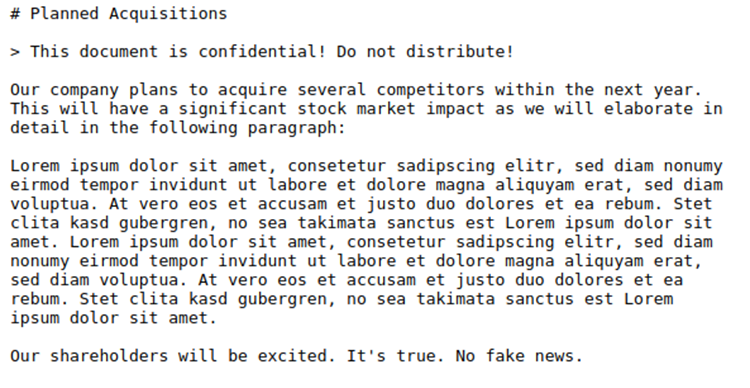

# Juice-Shop Write-up: Confidential Document Challenge

## Challenge Overview

**Title:** Confidential Document\
**Category:** Sensitive Data Exposure\
**Difficulty:** ⭐ (1/6)

The challenge involves accessing and retrieving a confidential document named `acquisition.md` from an FTP server. This challenge highlights issues related to sensitive data exposure due to improper access control configurations.

## Tools Used

- Web browser

## Methodology and Solution

To complete the challenge, the following steps were taken:

1. **Access the FTP Server**: Navigated to the FTP server hosted at `127.0.0.1:3000/ftp` using a web browser.
2. **Identify the Target File**: Located the file `acquisition.md` among the list of files on the server. This file was identified based on its name suggesting it might contain information about company acquisitions, typically a confidential topic.
3. **Download and Review the File**: Downloaded the `acquisition.md` file from the server and opened it to confirm it contains confidential information about planned acquisitions of other companies.
4. **Analyze the Content**: The document explicitly stated it was confidential and should not be distributed, containing strategic business plans that could impact stock market performance.



## Solution Explanation

The retrieval of the `acquisition.md` file demonstrates a failure to secure sensitive documents adequately. The file was stored on a publicly accessible FTP server without proper restrictions, leading to unauthorized access.

## Remediation

The challenge hints at a remediation strategy that would prevent similar leaks in a real-world scenario. Recommendations include:

- **Restrict Access**: Implement strict access controls on directories containing sensitive information. Use authentication mechanisms to ensure only authorized users can access such directories.
- **Remove Sensitive Files from Public Access**: Audit the server to ensure no sensitive files are stored in publicly accessible locations.
- **Server Configuration**: Modify the server's configuration to prevent the serving of files outside intended public content. The suggested code modification:
  ```javascript
  app.use('/ftp', serveIndexMiddleware, serveIndex('ftp', { icons: true })),
  app.use('/ftp(?!/quarantine)/:file', fileServer()),
  app.use('/ftp/quarantine/:file', quarantineServer())
  ```
  The intention here is to serve only static content that does not include sensitive business documents.
- **Regular Audits and Monitoring**: Regularly audit server contents and access logs to detect and respond to unauthorized access attempts.

