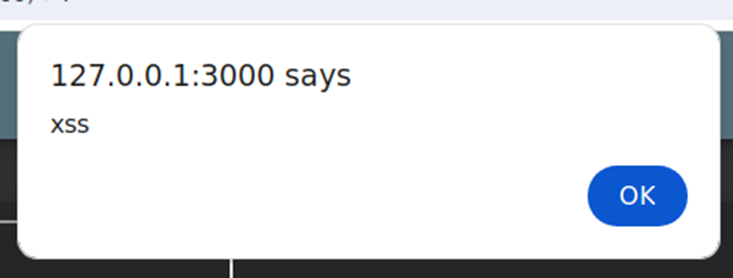

# Juice-Shop Write-up: DOM XSS

## Challenge Overview

**Title:** DOM XSS\
**Category:** Cross-Site Scripting (XSS)\
**Difficulty:** ⭐ (1/6)

The "DOM XSS" challenge requires to perform a DOM-based XSS attack by injecting malicious JavaScript code into a web application's Document Object Model via an unfiltered input field, specifically targeting an `iframe` source attribute.

## Tools Used

- **Web Browser**: For executing the attack and observing its effects.

## Methodology and Solution

### Exploit Overview

The challenge involves injecting an XSS payload into a dynamic content area of a web application. The target is an input parameter that affects the DOM directly without proper sanitization.

### Steps Taken to Solve the Challenge

1. **Identify the Injection Point**:
   - The application's search functionality was identified as a possible vector for XSS attacks. The search parameter `q` in the URL was used to manipulate the DOM.

2. **Craft the Payload**:
   - The XSS payload used was: `<iframe src="javascript:alert(`xss`)">`. This script is designed to execute JavaScript directly from the iframe source attribute, triggering an XSS alert.

3. **Encode and Inject the Payload**:
   - The payload was URL-encoded to bypass basic URL parsing and injected into the application via the search URL: `http://127.0.0.1:3000/#/search?q=%3Ciframe%20src=%22javascript:alert(%60xss%60)%22%3E`

4. **Execute the Attack**:
   - Navigating to the manipulated URL resulted in the execution of the malicious script, displaying an alert box indicating a successful XSS attack.

   

### Solution Explanation

The challenge was solved by successfully injecting and executing a JavaScript code through an iframe's source attribute in a URL parameter that influences the DOM. This demonstrated a classic case of DOM-based XSS where user input directly affects the DOM without proper sanitization.

## Remediation

To prevent DOM-based XSS attacks like the one demonstrated, the following strategies should be employed:

- **Use Frameworks that Automatically Handle XSS**: Modern frameworks like Angular, React, and Vue.js have built-in mechanisms to prevent XSS by escaping or sanitizing user inputs by default. Ensure these features are enabled and properly configured.
- **Sanitize User Inputs**: Apply rigorous input validation and sanitization on both the client and server-side to prevent malicious scripts from being executed.
- **Content Security Policy (CSP)**: Implement CSP headers to restrict the sources of executable scripts and mitigate the impact of any successful XSS attacks.

For detailed guidelines on preventing DOM-based XSS, resources such as the OWASP DOM-based XSS Prevention Cheat Sheet offer extensive mitigation techniques: https://cheatsheetseries.owasp.org/cheatsheets/DOM_based_XSS_Prevention_Cheat_Sheet.html
