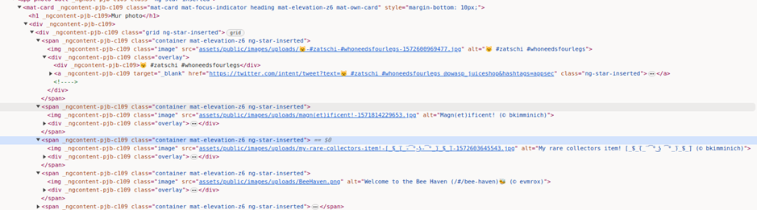
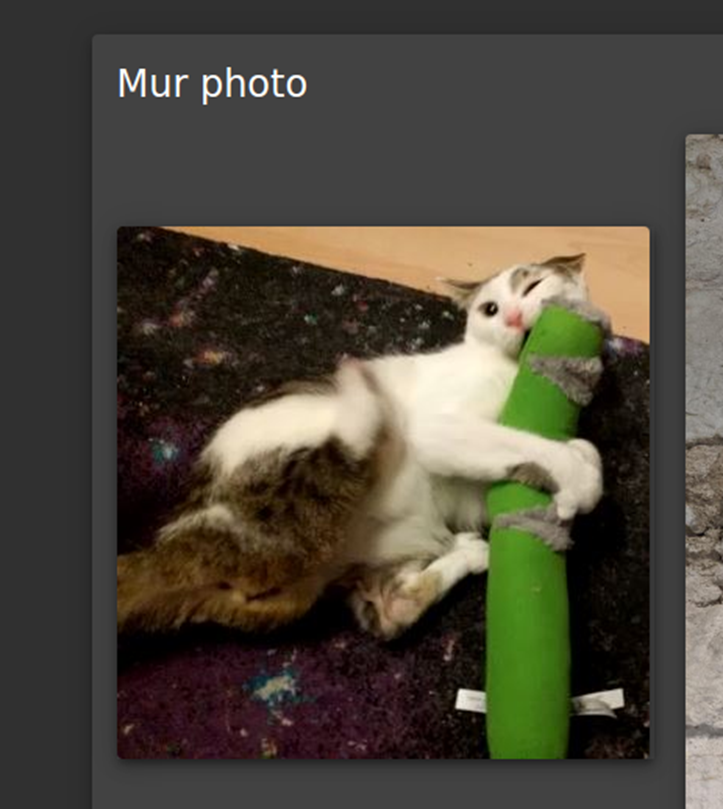

# Juice Shop Write-up: Missing Encoding Challenge

## Challenge Overview

**Title:** Missing Encoding\
**Category:** Improper Input Validation\
**Difficulty:** ⭐ (1/6)

This challenge ask us to retrieve a specific image from a web application that fails to load due to encoding issues in its URL. This involves understanding how web browsers handle URLs and the importance of proper URL encoding.

## Tools Used

- Web browser with developer tools
- Online URL encoding tool

## Methodology and Solution

To address the "Missing Encoding" challenge, I followed these steps:

1. **Identify the Issue**: Noticed an image that was not loading on the photo wall of the application. Inspecting the element using browser developer tools showed that the `src` attribute of the image tag contained special characters (emoji) which were not URL encoded.

2. **Understand the Problem**: Realized that the lack of proper URL encoding for the special characters in the image source URL caused the browser to fail in fetching the image.

3. **Use URL Encoding Tool**: Accessed an online URL encoding tool to properly encode the URL that includes special characters. This involved encoding characters such as emojis which are not normally handled correctly by browsers if not properly encoded. This is the URL that I obtained : assets%2Fpublic%2Fimages%2Fuploads%2F%F0%9F%98%BC-%23zatschi-%23whoneedsfourlegs-1572600969477.jpg

4. **Replace the URL**: Copied the encoded URL and replaced the original URL in the `src` attribute of the image tag using the browser's developer tools.

5. **Reload and Verify**: Refreshed the page or reloaded the image to verify that the image now displayed correctly.

## Solution Explanation

The original URL of the image included emojis and other special characters that should have been URL encoded. Web browsers expect URLs to be properly encoded to interpret them correctly. The solution required encoding the URL so that the browser could correctly parse and locate the image on the server.

## Remediation

The primary remediation step here is to ensure that all URLs, especially those that might contain non-standard characters, are properly URL encoded before being embedded in web pages. This can generally be handled in two ways:

- **Backend Solution**: Ensure that the server-side code that generates URLs encodes them before sending them to the client.
- **Client-Side Checks**: Implement client-side checks or functions that encode URLs as needed before using them in an HTML document.

