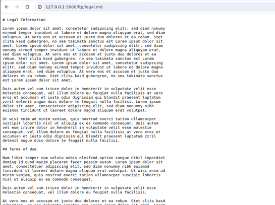

# Juice Shop Write-up: Privacy Policy Challenge

## Challenge Overview

**Title:** Privacy Policy\
**Category:** Miscellaneous\
**Difficulty:** ⭐ (1/6)

The objective of this challenge is to consult the Privacy Policy of the site, which indirectly provides clues about the path to an FTP server. The challenge tests attention to detail and ability to derive insights from seemingly non-technical information.

## Tools Used

- Web browser

## Methodology and Solution

The steps taken to solve the Privacy Policy challenge were straightforward:

1. **Locate the Privacy Policy**: Navigated to the section of the website where legal or privacy-related documents are likely to be found. This page is likely the page about : 127.0.0.1:3000/#/about 
2. **Examine the Content**: Opened and thoroughly read the Privacy Policy, which in this case was presented as a Markdown file (`legal.md`).

## Solution Explanation

It's only necessary to open the file.

## Remediation

In a real-world scenario, ensuring that no sensitive information (intentional or accidental) leaks through legal or policy documents is crucial. Regular audits and reviews of all published content should be conducted to safeguard against such disclosures.
