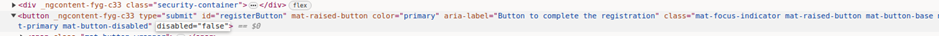

# Juice-Shop Write-up: Repetitive Registration Challenge

## Challenge Overview

**Title:** Repetitive Registration\
**Category:** Improper Input Validation\
**Difficulty:** ⭐ (1/6)

The "Repetitive Registration" challenge explores the improper validation of user input during the registration process, specifically focusing on the handling of password confirmation fields.

## Tools Used

- Web browser
- Developer tools

## Methodology and Solution

### Analysis of the Registration Form

Upon examining the registration form, it was noted that users are required to enter their password twice, a common practice intended to prevent typing mistakes. However, the challenge hint suggests exploiting the "Don't Repeat Yourself" (DRY) principle, which in this context implies that the system should not rely on redundant user input to function correctly.

### Steps Taken to Solve the Challenge

1. **Fill Out the Registration Form**:
   - Entered all required information including the email, password, and security question.
   - Intentionally provided different inputs for the "Password" and "Re-type your password" fields.

   

2. **Modify Form Behavior**:
   - Used the browser’s developer tools to inspect the 'Sign Up' button, which was disabled due to the mismatch in passwords.
   - Manually removed the `disabled` attribute from the button in the HTML code via the developer tools.

   

3. **Submit the Form**:
   - After enabling the button, submitted the form. Despite the passwords not matching, the registration succeeded, indicating a lack of server-side validation for this condition.

### Solution Explanation

The challenge was resolved by exploiting the lack of server-side validation for the password confirmation field. While the client-side of the application did initially prevent form submission when passwords did not match, this check was easily bypassed by modifying HTML attributes client-side, highlighting a critical security flaw.

## Remediation

To prevent such vulnerabilities in real applications, it is essential to enforce server-side checks in addition to client-side validations. Here are some recommendations:

- **Server-Side Validation**: Ensure that all input validations performed on the client side are also enforced on the server side. This includes matching password fields, input length restrictions, format requirements, and more.
- **Secure Form Handling**: Forms should be designed to reject submissions where critical fields have been tampered with or do not meet the application’s requirements.
- **Regular Security Audits**: Conduct thorough security audits that include testing for common vulnerabilities like improper input validation, especially in authentication mechanisms.
