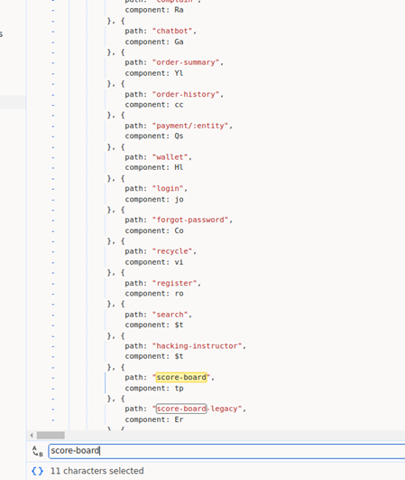

# Juice Shop Write-up: Score Board Challenge

## Challenge Overview

**Title:** Score Board\
**Category:** Miscellaneous\
**Difficulty:** ⭐ (1/6)

This challenge requires to locate a carefully hidden "Score Board" page within the application. The solution to this challenge involves analyzing the JavaScript code of the application to discover the route to the Score Board page.

## Tools Used

- Web browser (e.g., Chrome, Firefox)
- Developer Tools for viewing JavaScript source code

## Methodology and Solution

To solve the "Score Board" challenge, the approach involved inspecting the JavaScript code of the application. Here are the step-by-step details:

1. **Access Developer Tools**: I opened the developer tools in the web browser while interacting with the application.
2. **Review JavaScript Files**: Navigated to the "Sources" tab in the developer tools and reviewed the files loaded by the application.
3. **Analyze main.js**: Focused on the `main.js` file, as it often contains route definitions and application logic.
4. **Search for Hidden Routes**: Searched within the `main.js` file for mentions of various application routes. It was identified that the file explicitly listed several path definitions including the hidden "Score Board."

5. **Access the Score Board**: Used the route found in the `main.js` file to directly access the Score Board page by entering the path in the browser's address bar.

## Solution Explanation

The JavaScript file `main.js` was key to finding the Score Board as it contained all the route definitions used in the application. By examining this file, the route to the Score Board was easily discovered. This challenge tests basic skills in JavaScript analysis and understanding web application routing.

## Remediation

No remediation is necessary for this challenge as finding the hidden page was the intended goal of the exercise. However, in a real-world scenario, sensitive pages should not be discoverable through client-side code without appropriate access controls.

