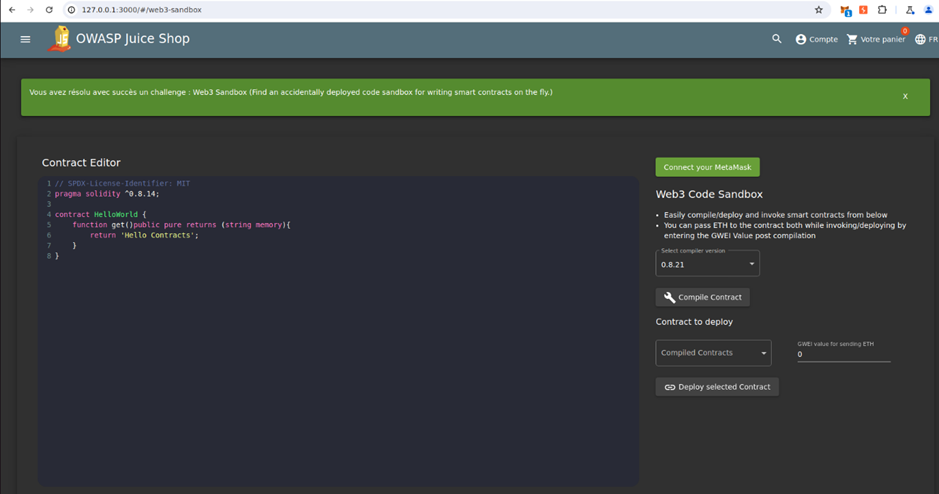

# Juice-Shop Write-up: Web3 Sandbox Challenge

## Challenge Overview

**Title:** Web3 Sandbox\
**Category:** Broken Access Control\
**Difficulty:** ⭐ (1/6)

This challenge requires discovering an accidentally deployed Web3 code sandbox that allows on-the-fly writing and testing of smart contracts. It explores the concept of broken access controls within web applications, particularly in environments involving Web3 technologies.

## Tools Used

- Web browser

## Methodology and Solution

The process to complete the Web3 Sandbox challenge was relatively straightforward:

1. **Discovery**: Began by exploring different URLs related to Web3 functionalities on the application, suspecting that the sandbox might be located at a somewhat obscure or less obvious path.
   
2. **Guessing URL**: Utilized a simple guessing approach, inspired by common directory names associated with testing or development environments like `/sandbox`, `/test`, `/dev`, or similar. In this case, it involved trying variations until hitting the correct URL: `http://127.0.0.1:3000/#/web3-sandbox`.

3. **Accessing the Sandbox**: Upon navigating to the correct URL, found a fully functional Web3 code sandbox environment. This sandbox included features for editing, compiling, and deploying Ethereum smart contracts directly from the browser.

## Solution Explanation

The challenge exploited a typical security oversight where development tools or experimental features are inadvertently left accessible in production environments. Accessing the URL directly provided unrestricted access to powerful functionalities intended for controlled use, posing significant security risks.

## Remediation

To prevent such issues and secure web applications from similar vulnerabilities:

- **Environment Segregation**: Ensure that development, testing, and production environments are strictly segregated. Tools and features that are used for development and testing should not be available on production servers.
- **Access Controls**: Implement robust access controls to restrict access to administrative or sensitive functionalities only to authorized users.
- **URL Guessing Mitigation**: Employ techniques like URL obfuscation or better yet, disable directory listing and ensure sensitive URLs are not easily guessable.
- **Regular Audits**: Conduct regular security audits and penetration testing to identify and rectify security lapses such as exposed internal tools or functionalities.
