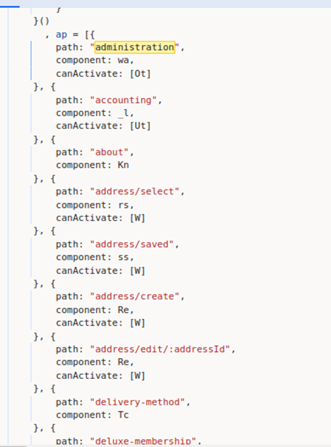
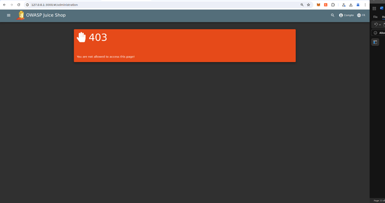
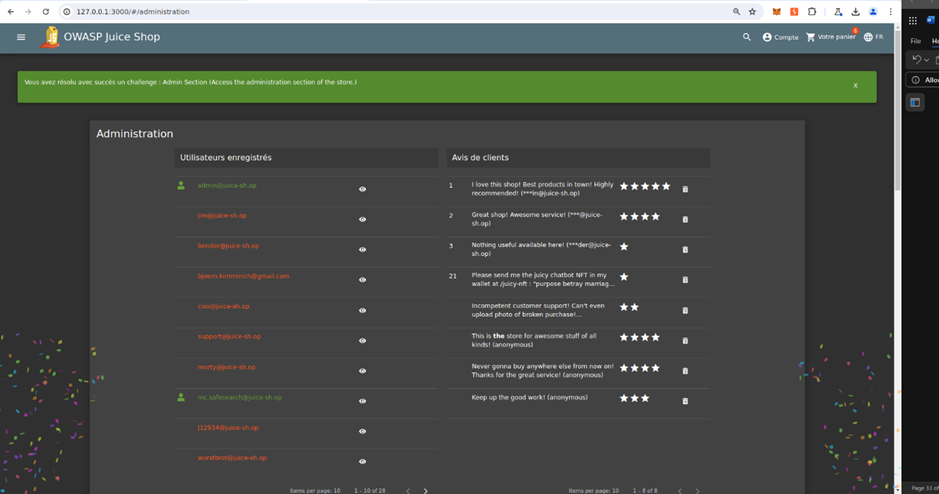

# Juice-Shop Write-up: Admin Section

## Challenge Overview

**Title:** Admin Section\
**Category:** Broken Access Control\
**Difficulty:** ⭐⭐ (2/6)

The "Admin Section" challenge involves accessing a restricted administrative area of a web application. 

## Tools Used

- **Web Browser**: For accessing the application and utilizing developer tools to inspect source files.
- **Developer Tools**: Specifically the source code viewer to examine the JavaScript files for route definitions.

## Methodology and Solution

### Exploring Application Routes

1. **Source Code Analysis**:
   - Using the browser's developer tools, the `main.js` file was examined. This file contained definitions for various application routes (paths and components), including a path for an "administration" section.
   - The route setup indicated that the administration area could be accessed directly if the correct path was known.

   

2. **Direct Path Access**:
   - Accessed the path `127.0.0.1:3000/#/administration` directly by entering it in the browser's address bar.
   - Initially, this approach led to an access-denied page due to insufficient permissions.

   

### Gaining Administrative Access

3. **Role Elevation**:
   - Logged in with an administrator account credentials.
   - Revisited the `/administration` path which now successfully displayed the administrative dashboard, demonstrating improper access control that relies solely on the obscurity of the path.

   

### Solution Explanation

The challenge was resolved by uncovering the hidden administrative path from the JavaScript source files and then accessing it with an administrator's credentials. This shows a vulnerability in the application where sensitive areas are not adequately secured but merely hidden, assuming unauthorized users will not discover the path.

## Remediation

To secure the admin section effectively, consider implementing the following:

- **Proper Access Control**: Ensure robust access control measures are in place that authenticate and authorize users before granting access to sensitive parts of the application. Use server-side checks to confirm permissions.
- **Separation of Concerns**: As suggested, separate the administrative functions from the main application. Ideally, host the admin panel on a different server or as a separate service that is not accessible from the public internet.
- **Use of Web Application Firewalls (WAF)**: Deploy a WAF to monitor and block unauthorized attempts to access restricted areas.

