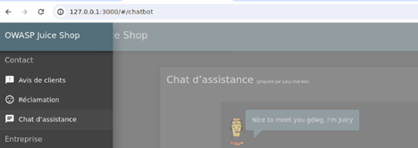
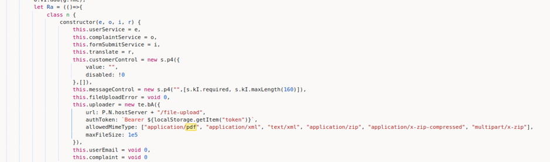
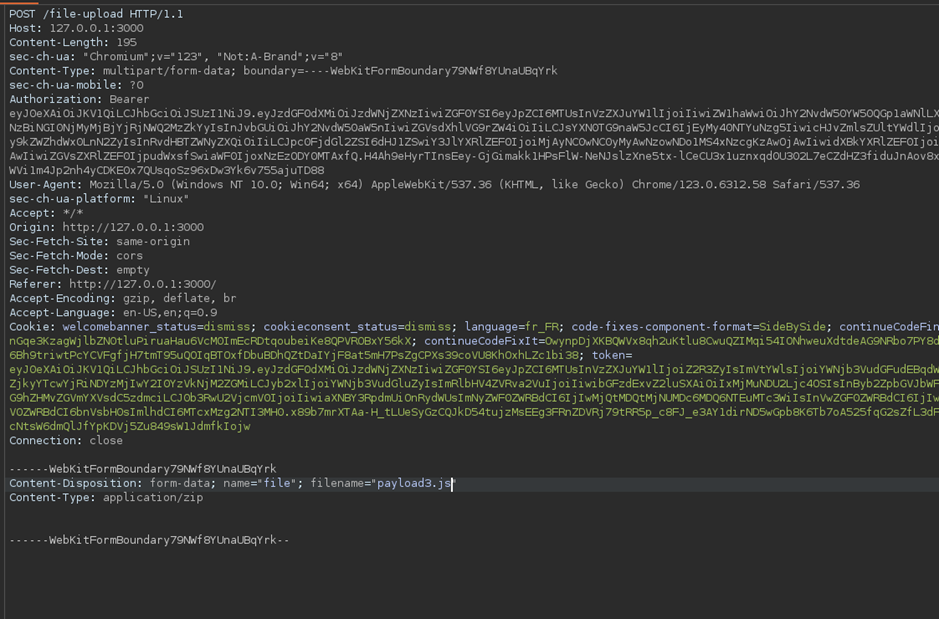

# Juice-Shop Write-up: Deprecated Interface

## Challenge Overview

**Title:** Deprecated Interface\
**Category:** Security Misconfiguration\
**Difficulty:** ⭐⭐ (2/6)

This challenge involves exploiting a deprecated interface that is no longer properly maintained or secured. 

## Tools Used

- **Web Browser**: To interact with the application's interface and upload files.
- **Developer Tools**: To inspect network requests and the application's JavaScript source code.

## Methodology and Solution

### Identifying the Vulnerable Interface

1. **Analysis of Existing Features**:
   - Reviewed the application and noticed that the `/complain` page seemed outdated, especially with the introduction of a new chatbot service for handling issues, making the former somewhat redundant.

### Examining the File Upload Feature

2. **Inspecting the JavaScript**:
   - Using browser developer tools, examined the `main.js` file that outlined the functionality for the deprecated `/complain` interface. Noted that a file uploader was part of this form.
   
   

   - Observed that the uploader's code attempted to restrict file uploads to certain MIME types (`application/pdf`, `text/xml`, `application/zip`, etc.).

   

3. **Manipulating File Uploads**:
   - Tested the uploader with a normal XML file, which was blocked. Changed the file extension to `.xml.zip` and tried uploading, but initially, it did not pass.
   - Modified the filename to remove `.zip` after selecting the file but before uploading, tricking the uploader into accepting an XML file without the `.zip` extension, bypassing the client-side checks.

   

### Exploiting the File Upload Vulnerability

4. **Exploiting the Misconfiguration**:
   - Successfully uploaded a crafted XML file that was mislabeled, exploiting a flaw in the interface's file handling and validation process. This could potentially lead to further attacks such as XML External Entity (XXE) injection or serving malicious content.

### Solution Explanation

The challenge was completed by exploiting the file uploader in a deprecated interface that lacked proper maintenance. This involved bypassing client-side file type checks through filename manipulation.

## Remediation

To prevent security issues related to deprecated or neglected features:

- **Regularly Update and Retire Old Features**: Audit and update or decommission outdated features regularly to avoid security gaps.
- **Secure File Uploads**: Implement robust server-side validation for file uploads. Ensure that MIME type checks are performed on the server side and not just client-side, and scan uploaded files for malware.
- **Access Controls and Monitoring**: Limit access to deprecated features and monitor them for unusual activity, as they may become targets for exploitation.
