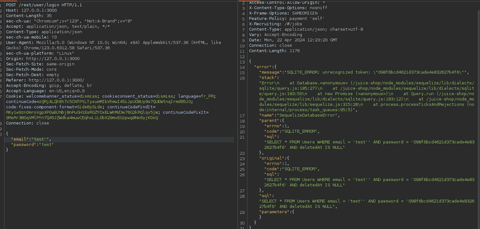
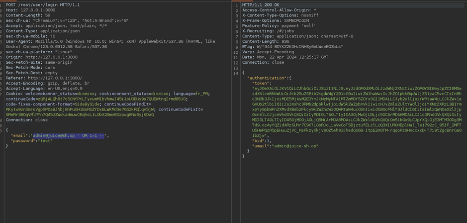

# Juice-Shop Write-up: Login Admin

## Challenge Overview

**Title:** Login Admin\
**Category:** SQL Injection\
**Difficulty:** ⭐⭐ (2/6)

This challenge, titled "Login Admin," requires exploiting an SQL Injection vulnerability within the authentication process of a web application to gain unauthorized access to the administrator's account.

## Tools Used

- **Web Browser**: For interacting with the login interface of the application.
- **Burp Suite**: Utilized for intercepting and modifying the HTTP requests to inject SQL code.

## Methodology and Solution

### Identifying the Vulnerability

Upon analyzing the login mechanism, it was noted that inserting special characters such as quotes (`'`) into the input fields caused SQL errors to be displayed, indicating the potential for an SQL Injection attack.

### Steps Taken to Solve the Challenge

1. **Intercept Login Request**:
   - Using Burp Suite, the HTTP POST request sent during a normal login attempt was intercepted. This request included user credentials in the form of JSON data.

   

2. **Modify the SQL Query**:
   - Modified the email field in the JSON payload to `admin@juice-sh.op' OR '1'='1' --`, effectively turning the SQL command into a statement that always returns true, bypassing the need for a password.

   
    
3. **Execute the Injected Request**:
   - The modified request was sent to the server. Due to the injected SQL code, the condition `OR '1'='1'` always evaluates as true, allowing unauthorized access to the administrator's account.

### Solution Explanation

The SQL Injection was successful due to improper input sanitization and lack of prepared statements in handling SQL queries. The injected code altered the logical structure of the SQL command, thereby bypassing authentication and logging in as the administrator without needing the actual password.

## Remediation

To prevent such vulnerabilities in real applications, it is crucial to implement the following security measures:

- **Use of Prepared Statements**: Utilize prepared statements with parameterized queries to prevent SQL injection. This technique ensures that the SQL interpreter recognizes the code and data separately.
- **Input Validation**: Implement strict validation for all user inputs to ensure only expected data types and formats are processed.
- **Error Handling**: Configure error messages to avoid revealing details about the database structure or any SQL syntax errors.
- **Security Testing**: Regularly conduct security assessments and penetration testing to identify and mitigate vulnerabilities like SQL injection.

