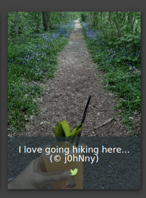
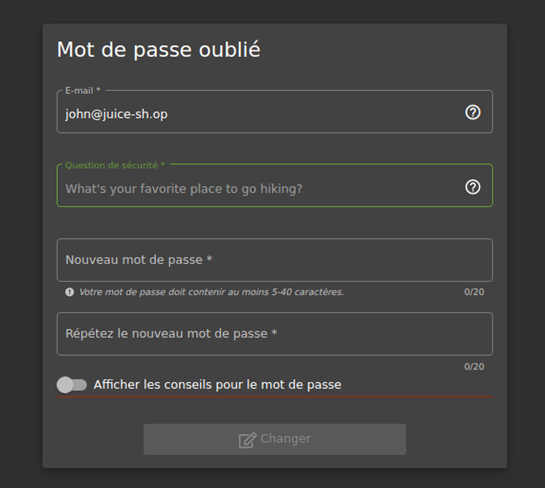
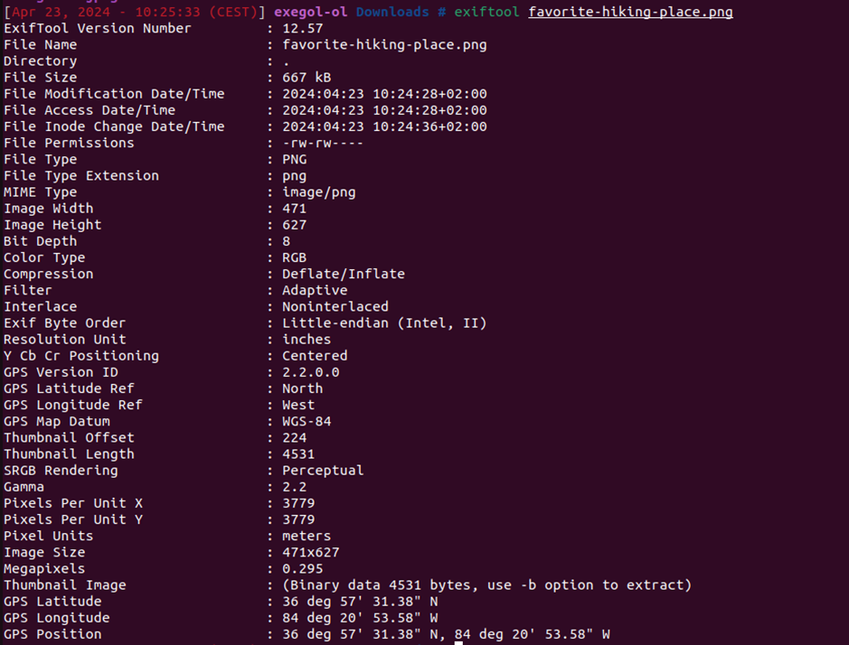
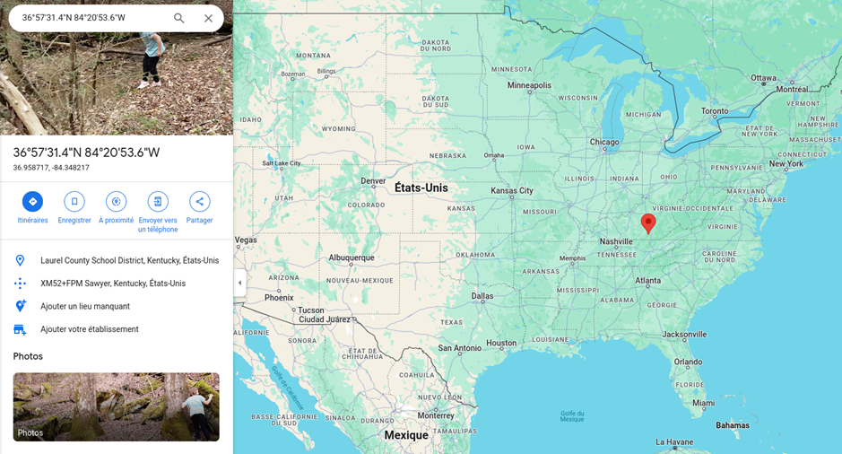
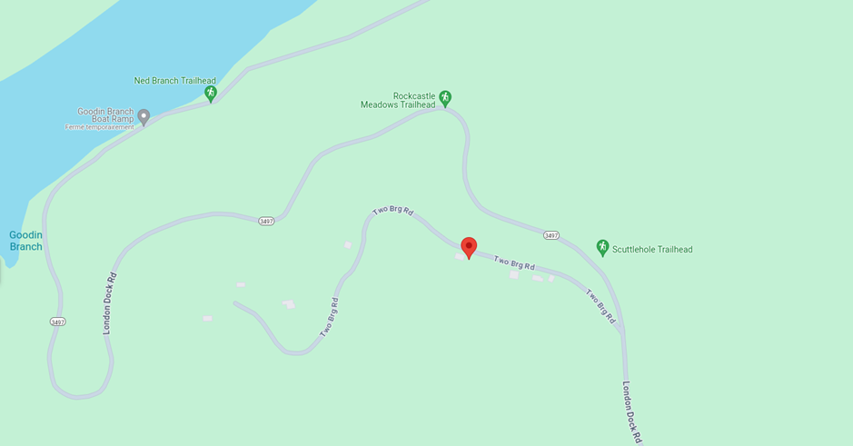
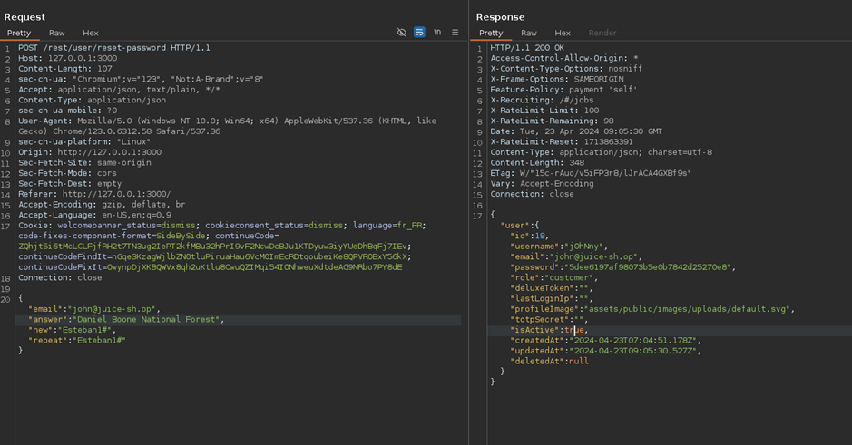

# Juice-Shop Write-up: Meta Geo Stalking

## Challenge Overview

**Title:** Meta Geo Stalking\
**Category:** Sensitive Data Exposure\
**Difficulty:** ⭐⭐ (2/6)

This challenge, "Meta Geo Stalking," tests ability to utilize metadata from images posted online to answer security questions and reset a user's password. 

## Tools Used

- **Web Browser**: For navigating to the image download link and accessing the password reset page.
- **ExifTool**: Used to extract GPS coordinates and other metadata from the image file.
- **GPS Mapping Tool / Google Maps**: To pinpoint the exact location from the GPS coordinates.

## Methodology and Solution

### Initial Setup and Discovery

1. **Identifying Security Question**:
   - Attempted to reset the password for John's account, which revealed the security question: "What is your favorite place to walk?"

   

   - This corresponds directly to the image caption located in photo wall, hinting that the answer is related to the location shown in the photo.

   

2. **Downloading and Analyzing the Image**:
   - Downloaded the image from `http://127.0.0.1:3000/assets/public/images/uploads/favorite-hiking-place.png`.
   - Used ExifTool to extract metadata from the image, which included GPS coordinates.

### Locating the Exact Place

3. **Using GPS Coordinates**:
   - Input the GPS coordinates into a mapping tool to get a precise location. The coordinates extracted were `36°57'31.38"N 84°20'53.58"W`.

   

   - Google Maps confirmed the location as Daniel Boone National Forest.

   

   

   

### Password Reset

4. **Answering Security Question and Resetting Password**:
   - With the location identified as Daniel Boone National Forest, this was used as the answer to the security question.
   - Successfully reset John’s password using the location information derived from the image’s metadata.

   

### Solution Explanation

The challenge was solved by correlating the security question with the location data embedded within an image's metadata. This demonstrates how seemingly harmless sharing of location-tagged images can lead to security breaches if such information aligns with security question answers.

## Remediation

To mitigate risks associated with metadata in shared images and sensitive data exposure:

- **Metadata Scrubbing**: Encourage users to remove metadata from photos before uploading them to public platforms, or implement server-side processes to automatically strip this data.
- **Use Non-Descriptive Security Questions**: Employ security questions that do not directly relate to information that could be publicly deduced or found through OSINT techniques. Better option is to not use security questions and rather send an email for resetting password.

