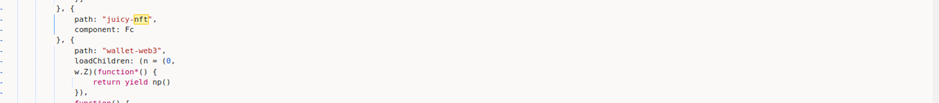
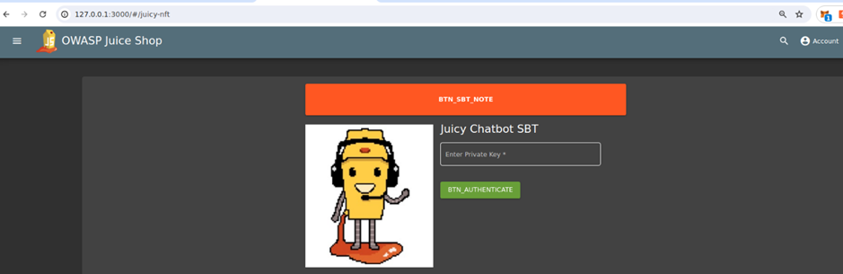
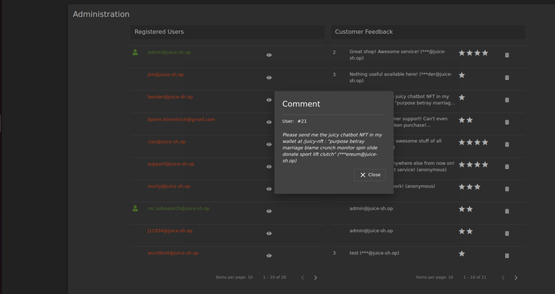

# Juice-Shop Write-up: NFT Takeover

## Challenge Overview

**Title:** NFT Takeover\
**Category:** Sensitive Data Exposure\
**Difficulty:** ⭐⭐ (2/6)

The "NFT Takeover" challenge involves gaining access to a digital wallet containing an official Soul Bound Token (NFT) by leveraging sensitive information exposed inadvertently through user feedback.

## Tools Used

- **Web Browser**: To navigate to the specific page and interact with the web application.
- **Mnemonic Converter**: Used to convert seed phrases into private keys necessary for blockchain wallet access.

## Methodology and Solution

### Finding the NFT Access Point

1. **Navigating to the NFT Page**:
   - Explored the application's JavaScript files to find any references to "NFT," leading to the discovery of the `/juicy-nft` path.

   

   - Accessed `http://127.0.0.1:3000/#/juicy-nft`, which prompted for a private key to access the NFT wallet.

   

### Utilizing Exposed Sensitive Information

2. **Extracting the Seed Phrase from User Feedback**:
   - Found a user feedback comment that inadvertently shared a seed phrase: "purpose betray marriage blame crunch monitor spin slide donate sport lift clutch."

   

   - Recognized that this seed phrase likely relates to the private key required by the `/juicy-nft` page.

3. **Converting the Seed Phrase to a Private Key**:
   - Used a Mnemonic converter tool to transform the seed phrase into a corresponding private key. 
   - Obtained the private key: `0x5bcc3e9d38baa06e7bfaab80ae5957bbe8ef059e640311d7d6d465e6bc948e3e`.

### Accessing the NFT Wallet

4. **Authenticating and Taking Over the NFT**:
   - Entered the derived private key on the NFT page, which authenticated access to the wallet containing the Soul Bound Token.

### Solution Explanation

The challenge was successfully completed by identifying and exploiting a security lapse where a user inadvertently disclosed a seed phrase in the feedback section. This seed phrase was converted into a private key, granting unauthorized access to an NFT wallet. 

## Remediation

To prevent such security vulnerabilities:

- **Secure Information Handling**: Ensure that any form of sensitive information, such as cryptographic keys or seed phrases, is neither stored nor transmitted in clear text within user-accessible areas.
- **Input Validation and Sanitization**: Implement stringent input validation and sanitization on all user-submitted content to prevent inadvertent exposure of sensitive data.
- **Monitoring and Filtering**: Deploy monitoring tools to detect and alert on potential exposure of sensitive information, and employ automated filtering to obscure or block the display of such data.

