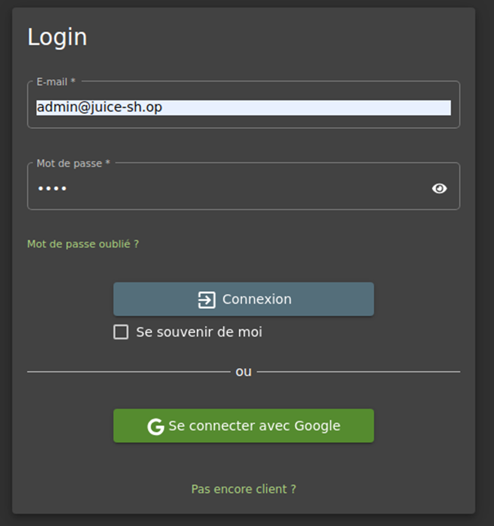
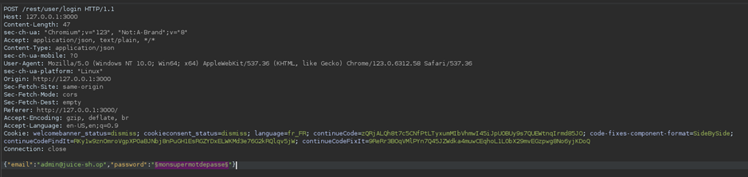

# Juice-Shop Write-up: Password Strength

## Challenge Overview

**Title:** Password Strength\
**Category:** Broken Authentication\
**Difficulty:** ⭐⭐ (2/6)

The "Password Strength" challenge explores vulnerabilities associated with weak password policies, specifically focusing on the ease of brute-forcing the administrator's weak password. This challenge underscores the importance of implementing robust password policies to secure authentication mechanisms.

## Tools Used

- **Web Browser**: For interacting with the authentication interface.
- **Burp Suite**: Utilized for intercepting web requests and conducting the brute-force attack.

## Methodology and Solution

### Identifying Administrator Credentials

1. **Locate Administrator's Email**:
   - Scanned the website for visible or hidden mentions of the administrator's email. Comments in the website's source code revealed the email address: `admin@juice-sh.op`.

   

### Brute Force Attack

2. **Intercept Login Request**:
   - Attempted to log in with the administrator email and a random password.
   - Intercepted the login request using Burp Suite to capture the request details necessary for the brute-force attack.

   

3. **Setup Brute Force in Burp Suite**:
   - Configured Burp Suite's Intruder module to use a list of common passwords, replacing the placeholder password with each entry from the list during the attack.

   

4. **Execute the Attack**:
   - Ran the brute force attack and monitored the responses for successful authentication indicators.
   - Successfully authenticated using the password: `admin123`.

   

### Solution Explanation

The brute force attack was effective due to the weak password policy employed by the application, which allowed the use of common and easily guessable passwords. This challenge was solved by identifying and exploiting this vulnerability to gain unauthorized access to the administrator's account.

## Remediation

To prevent such vulnerabilities in real-world applications, consider the following steps:

- **Strong Password Policies**: Enforce a strong password policy that requires a mix of uppercase letters, lowercase letters, numbers, and special characters. Passwords should be at least 8 characters long.
- **Password Complexity and Blacklists**: Implement checks to ensure passwords are not among common passwords or compromised passwords listed in public breaches.
- **Rate Limiting**: Prevent brute force attacks by limiting the number of failed login attempts from a single IP address or account before a cooldown period is enforced.
- **Multi-Factor Authentication (MFA)**: Add an additional layer of security by requiring a second form of verification beyond just a password.

For further reading on best practices for password security, refer to NIST Special Publication 800-63B and explore additional resources such as OWASP's guidelines on authentication: https://cheatsheetseries.owasp.org/cheatsheets/Authentication_Cheat_Sheet.html.

