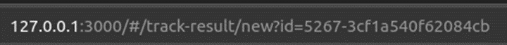
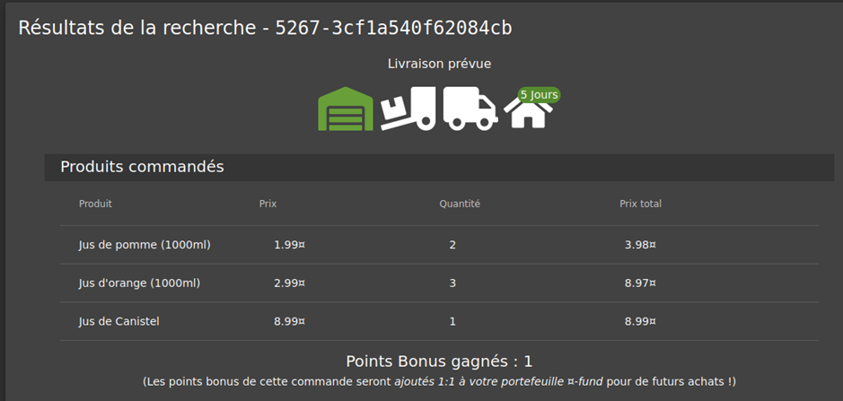
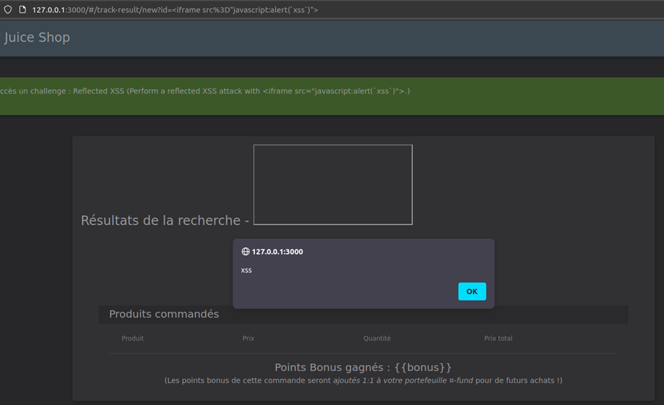

# Juice-Shop Write-Up: Reflected XSS

## Challenge Overview
**Title:** Reflected XSS  
**Category:** Web Exploitation  
**Difficulty:** ⭐⭐ (2/6)  

The objective of this challenge is to exploit a reflected cross-site scripting (XSS) vulnerability in the web application by injecting malicious JavaScript code that gets executed when the page is loaded.

## Tools Used
- **Web Browser:** For navigating the web application and testing XSS payloads.
- **Developer Tools:** To inspect HTML and JavaScript code on the web application.

## Methodology and Solution

### Step 1: Initial Payload Testing (not working)
I started by testing a basic XSS payload in the search bar of the application using the `q` parameter:
```html
<iframe src="javascript:alert(`xss`)">
```
While this payload executed successfully, it did not meet the challenge requirements as it wasn't reflected on the page.

### Step 2: Finding a Reflective Surface
To find a place where the input is reflected directly on the page, I navigated through the application and identified that the order tracking page uses an `id` parameter in the URL to display the order details. 



This `id` parameter is reflected in the response.



### Step 3: Crafting the Payload
I crafted a payload to be injected via the `id` parameter in the URL:
```html
http://127.0.0.1:3000/#/track-result?id=test
```

### Step 4: Inserting the Payload
By navigating to the URL with the crafted payload, the input was reflected on the order tracking page, leading to the execution of the JavaScript code:
```html
http://127.0.0.1:3000/track-result?id=<script>alert('xss')</script>
```
When this URL is loaded, the script executes, confirming the reflected XSS vulnerability.



### Solution Explanation
The challenge was solved by identifying a reflected XSS vulnerability in the `id` parameter of the order tracking page. By injecting a script tag into this parameter, the malicious JavaScript code was executed when the page was loaded.

### Remediation
To prevent reflected XSS vulnerabilities, the application should:
- **Validate and Sanitize Input:** Ensure that all user inputs are properly validated and sanitized before being included in the HTML response.
- **Encode Output:** Use proper HTML encoding for user-supplied data before rendering it in the HTML content to prevent the execution of injected scripts.

