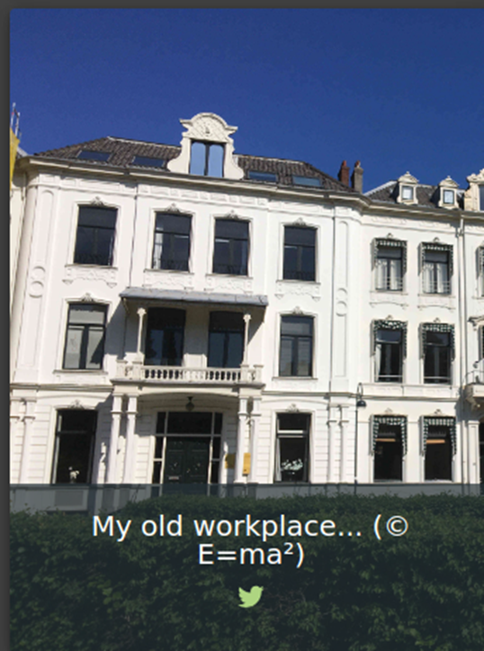
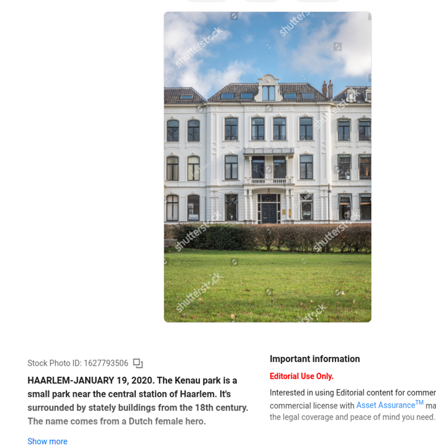
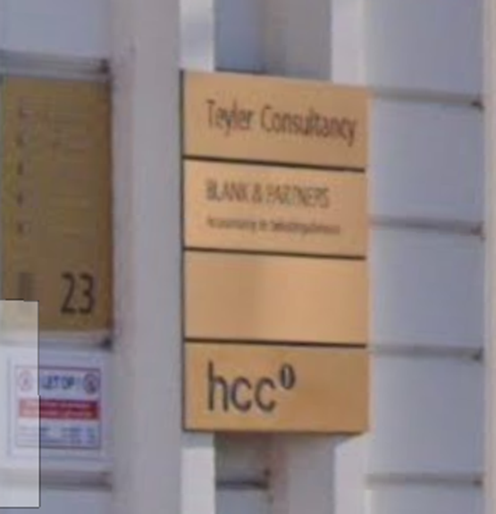
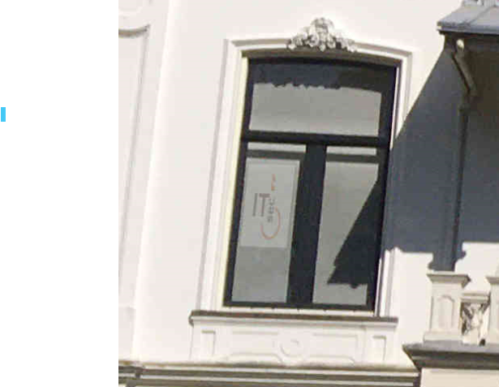

# Juice-Shop Write-up: Visual Geo Stalking

## Challenge Overview

**Title:** Visual Geo Stalking\
**Category:** Sensitive Data Exposure\
**Difficulty:** ⭐⭐ (2/6)

This challenge, "Visual Geo Stalking," involves using publicly available visual data to deduce the answer to a security question and then using that information to reset a user's password. It tests abilities in image analysis, OSINT techniques, and creative thinking to link seemingly unrelated data for accessing sensitive information.

## Tools Used

- **Google Lens**: For identifying locations and objects within an image.
- **Google Maps**: To explore the surroundings of a pinpointed location and gather additional information.
- **Web Browser**: For general research.

## Methodology and Solution

### Initial Clue Analysis

1. **Photo Examination**:
   - Emma's post on a social media-like platform includes a photo of a building with a caption referencing a past workplace.
   - The challenge involves identifying Emma's former workplace through the image provided.

   

### Detailed Image Analysis

2. **Utilizing Google Lens**:
   - The image was analyzed using Google Lens, which identified the location as the "Kenau Park area in Haarlem."

   

3. **Google Maps Exploration**:
   - Using Google Maps to virtually visit the location, various business signs and plaques were examined to match potential answers to security questions.

   

4. **Identifying Key Details**:
   - A close inspection of another part of the image revealed a sign for "ITsec" on a window. This detail seemed crucial but was initially overlooked.

### Answering the Security Question and Resetting the Password

5. **Security Question Answering**:
   - The term "ITsec" was attempted as an answer to a security question regarding Emma's former workplace, based on the context provided by the visual clues in the photo and the information deduced from online tools.

   

6. **Password Reset**:
   - Successfully using "ITsec" as the security question answer allowed the password for Emma's account to be reset.

### Solution Explanation

The challenge was successfully resolved by combining visual data from a user-generated post with online mapping tools and image recognition technology. This approach highlights the potential privacy risks associated with sharing detailed visual information publicly.

## Remediation

To prevent sensitive data exposure through visual or other publicly accessible information:

- **Educate Users**: Inform users about the risks associated with sharing detailed photos or information that could inadvertently reveal answers to security questions or other sensitive data.
- **Privacy Settings**: Encourage the use of strict privacy settings on social media and other platforms to control who can view personal information and posts.
- **Security Question Choices**: Advise against using easily discoverable information as answers to security questions. Encourage more personal and less predictable answers.

