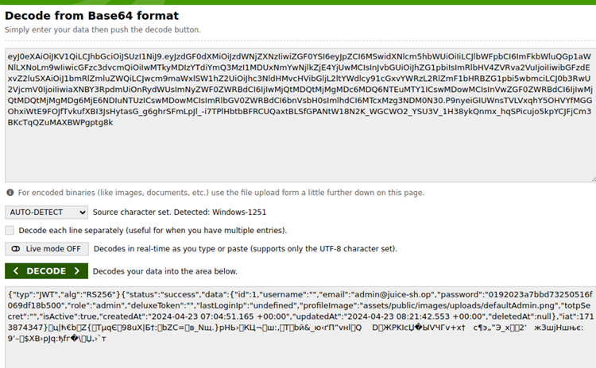

# Juice-Shop Write-up: Weird Crypto

## Challenge Overview

**Title:** Weird Crypto\
**Category:** Cryptographic Issues\
**Difficulty:** ⭐⭐ (2/6)

This challenge, "Weird Crypto," tests ability to identify and report the use of deprecated cryptographic methods within the application. Specifically, it focuses on the insecure implementation of password hashing.

## Tools Used

- **Web Browser**: To inspect the authentication token and submit the vulnerability report.
- **Base64 Decoder**: To decode authentication tokens that are encoded in Base64.

## Methodology and Solution

### Analyzing the Authentication Token

1. **Token Inspection**:
   - Extracted the JWT (JSON Web Token) from the browser's cookie storage.
   - Noticed that the JWT payload is encoded in Base64. Used a Base64 decoder to reveal the contents. 

   

   Note : a more simple approach maybe a simple copy paste in jwt.io

### Identifying the Cryptographic Flaw

2. **Decoding the JWT Payload**:
   - Decoded the Base64 string to find the payload in clear text, revealing various user attributes including the hashed password.
   - The hashed password appeared as `"password":"0192023a7bbd73250516f069df18b500"`.

3. **Hash Analysis**:
   - Recognized the hash pattern and length as indicative of an MD5 hash. Given MD5's known vulnerabilities and its deprecation in security best practices, this was identified as the target for reporting.

### Reporting the Issue

4. **Using the Contact Form**:
   - Used the application's contact form to report the insecure use of MD5 for hashing passwords.

### Solution Explanation

The challenge was completed by identifying the use of an insecure and outdated cryptographic method (MD5) for password hashing. By decoding the JWT and analyzing the hash, the method was confirmed. The issue was then reported through the appropriate channel within the application, fulfilling the challenge's requirements.

## Remediation

To mitigate the risk associated with deprecated cryptographic functions:

- **Upgrade Hashing Algorithms**: Replace MD5 with stronger hashing algorithms such as SHA-256 or bcrypt, which provide greater resistance to brute force attacks and do not suffer from quick hash computation and vulnerabilities like collision attacks.
- **Add Salt**: Use a unique salt for each password hash to prevent the use of precomputed rainbow tables and increase the complexity of cracking efforts.
