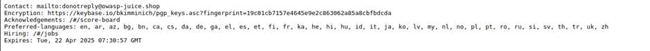

# Juice-Shop Write-up: Locate Security Policy File

## Challenge Overview

**Title:** Locate Security Policy File\
**Category:** OSINT/Discovery\
**Difficulty:** ⭐⭐ (2/6)

This challenge involves locating a hidden `security.txt` file on a web server. `Security.txt` is a proposed standard that allows websites to define security policies.

## Tools Used

- **Web Browser**: For accessing URLs and viewing web content.

## Methodology and Solution

### Background Research

1. **Understand the `security.txt` Concept**:
   - Initial research revealed that `security.txt` is a draft by the Internet Engineering Task Force (IETF) aimed at making it easier for organizations to disclose security practices. Websites are encouraged to place this file under the `/.well-known/` directory according to the draft's guidelines (https://securitytxt.org/).

### Search Strategy

2. **Standard Directory Check**:
   - Based on the research, the standard location to store such files is within the `/.well-known/` directory. This directory is typically used for web services to define various metadata about the site.

3. **Access the File**:
   - Navigate directly to `http://127.0.0.1:3000/.well-known/security.txt` in the web browser.
   - Successfully locate the `security.txt` file, which contains contact information, encryption details, preferred languages for security communication, and hiring information.

   

### Solution Explanation

The challenge was resolved by leveraging knowledge about where web applications commonly store security policy files. By following the standard outlined by securitytxt.org, the file was easily located, demonstrating the importance of familiarizing oneself with web security practices and standards.

## Remediation

For real-world application:
- **Implement `security.txt`**: It is beneficial for organizations to implement a `security.txt` file to facilitate communication about security issues. This file should be placed in the `/.well-known/` directory as recommended.
- **Secure Access**: Ensure that any sensitive information disclosed through the `security.txt` does not inadvertently expose the site to additional security risks.
- **Regular Updates**: Keep the information in the `security.txt` file up-to-date, including contact information and cryptographic keys.

