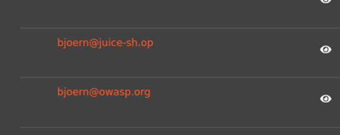
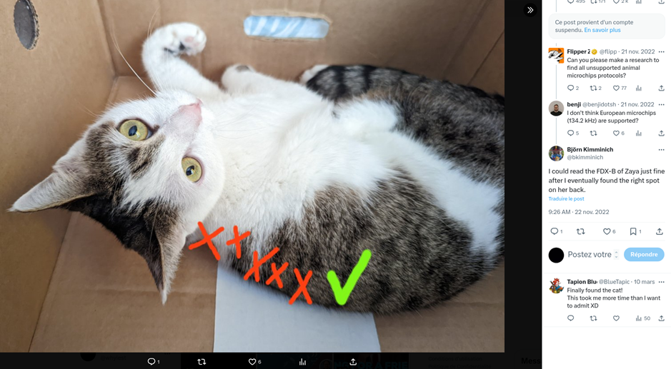
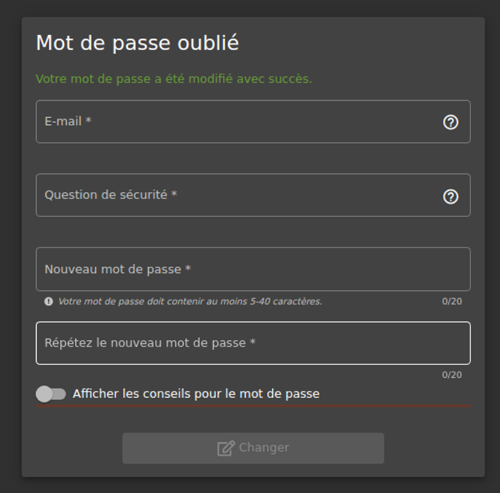

# Juice-Shop Write-up: Bjoern’s Favorite Pet

## Challenge Overview

**Title:** Bjoern’s Favorite Pet\
**Category:** OSINT (Open Source Intelligence)\
**Difficulty:** ⭐⭐⭐ (3/6)

The "Bjoern’s Favorite Pet" challenge involves using open-source intelligence to discover personal information related to Bjoern, specifically identifying the name of his favorite pet, which is used as the answer to a security question.

## Tools Used

- **Web Browser**: To access the administration panel and social media platforms.
- **OSINT Techniques**: Leveraging publicly available data to gather personal information.

## Methodology and Solution

### Gathering Initial Information

1. **Identifying Bjoern’s Email**:
   - Accessed the administrative panel of the application to obtain Bjoern’s email address, which is `bjoern@owasp.org`.

   

### Using OSINT to Find the Pet's Name

2. **Exploring Social Media**:
   - Used Bjoern’s email address to search for his social media profiles. Located his Twitter account.
   - On Twitter, found a post by Bjoern featuring a picture of his cat named Zaya.

   

### Leveraging the Information

3. **Answering the Security Question**:
   - With the name of Bjoern’s cat discovered, used "Zaya" as the answer to the security question associated with resetting or accessing his account.

   

### Solution Explanation

The challenge was solved by effectively utilizing OSINT skills to identify Bjoern's pet’s name, which was critical for bypassing security controls related to personal accounts. By connecting an email obtained from an admin panel to personal content shared on social media, this task highlights the importance of carefully managing personal information online.

## Remediation

To mitigate similar vulnerabilities in real-world scenarios:

- **Use of Non-Personal Security Questions**: Encourage or enforce the use of security questions that do not rely on information that could easily be obtained or guessed through public data. Note that it's better to not use security question
but rather send email when user want to reset his password.
- **Privacy Settings**: Advise users to utilize privacy settings on social media platforms to control who can see their posts, especially when sharing personal or potentially sensitive information.
