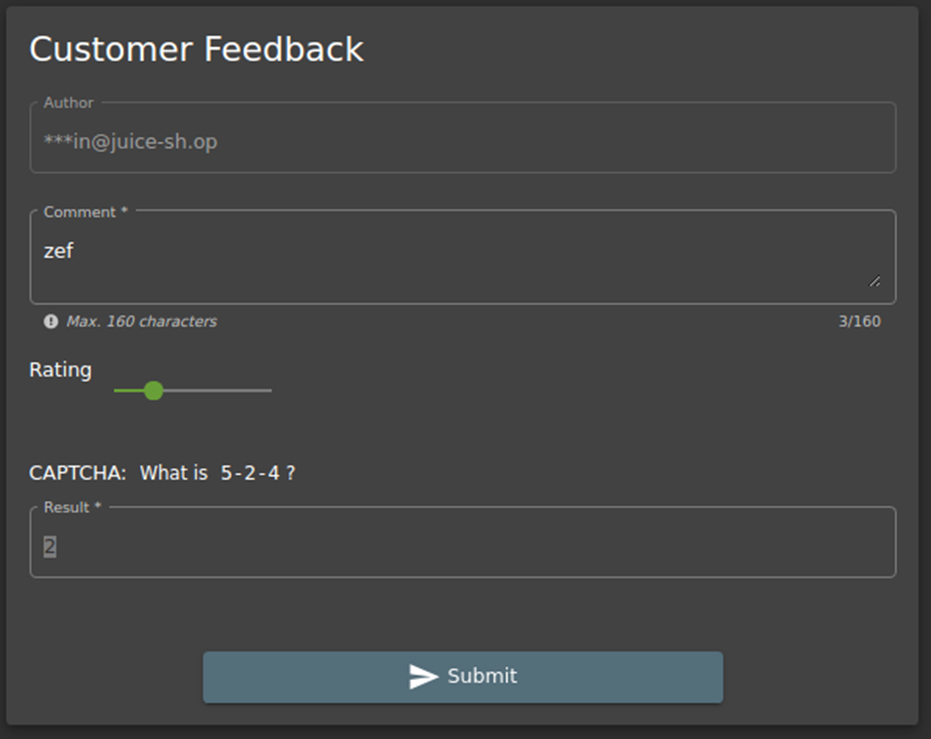
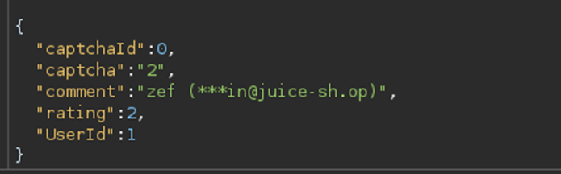
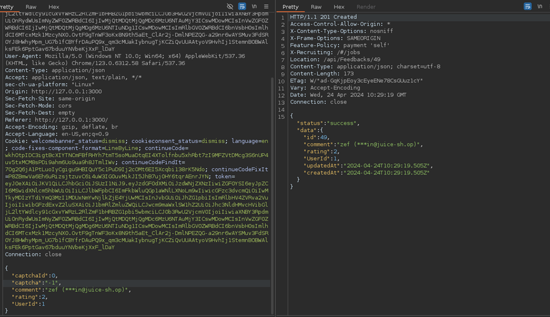

# Juice-Shop Write-up: CAPTCHA Bypass

## Challenge Overview

**Title:** CAPTCHA Bypass\
**Category:** Broken Anti-Automation\
**Difficulty:** ⭐⭐⭐ (3/6)

The "CAPTCHA Bypass" challenge requires to circumvent CAPTCHA protections to submit multiple customer feedback entries within a short period.

## Tools Used

- **Web Browser**: To interact with the feedback submission form.
- **HTTP Interception Tool** (e.g., Burp Suite): To capture and manipulate HTTP requests.

## Methodology and Solution

### Initial Feedback Submission

1. **Submitting a Feedback**:
   - Navigate to the feedback submission form and enter a comment, rating, and solve the CAPTCHA challenge as normal. Click submit to send the feedback.

   

### Interception and Analysis

2. **Capturing the Submission Request**:
   - Use Burp Suite to intercept the HTTP POST request made when submitting feedback. Analyze the request payload and headers.

### Identifying CAPTCHA Mechanism Flaws

3. **Analyzing CAPTCHA Implementation**:
   - Notice that the CAPTCHA validation in the request relies solely on the `captchaId` and the provided `captcha` answer. 
   - Determine that the CAPTCHA system might not track or validate previous submissions effectively, possibly allowing the reuse of a single CAPTCHA solution multiple times.

   

### Automating CAPTCHA Reuse

4. **Replaying Requests**:
   - Modify the intercepted POST request to reuse the same `captchaId` and `captcha` answer. Change other fields like `comment` to simulate different feedback entries.
   - Rapidly replay the modified request multiple times (more than 10 times) within 20 seconds to challenge the anti-automation controls.

   

### Verifying Challenge Completion

5. **Confirming Multiple Submissions**:
   - After submitting multiple feedback entries quickly, check the application’s response or dashboard to confirm that all entries were accepted without requiring new CAPTCHA solutions.

### Solution Explanation

The challenge was successfully completed by exploiting a weakness in the CAPTCHA mechanism, where a single validated CAPTCHA solution could be reused multiple times. This indicates a failure in the application’s anti-automation logic, as it should ideally track and validate each CAPTCHA attempt individually to prevent abuse.

## Remediation

To prevent such vulnerabilities in real-world applications:

- **CAPTCHA Robustness**: Implement CAPTCHA systems that track attempts and ensure each CAPTCHA challenge is only valid for one submission.
- **Enhance CAPTCHA Logic**: Consider using more sophisticated CAPTCHA solutions like reCAPTCHA, which includes advanced risk analysis.
- **Rate Limiting**: Introduce rate limiting for form submissions to reduce the risk of automated attacks.
- **Session-Based Validation**: Ensure that CAPTCHA validations are tied to user sessions and that each session can only use a CAPTCHA solution once.
