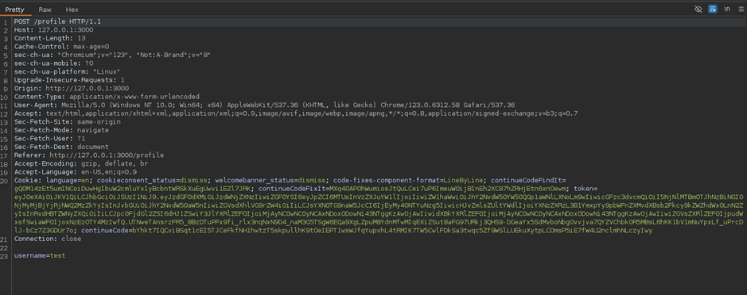

# Juice-Shop Write-up: CSRF

## Challenge Overview

**Title:** CSRF (Cross-Site Request Forgery)\
**Category:** Broken Access Control\
**Difficulty:** ⭐⭐⭐ (3/6)

The challenge "CSRF" involves executing a Cross-Site Request Forgery (CSRF) attack to change the name of a user on the OWASP Juice Shop platform without their consent.

## Tools Used

- **Web Browser**: Specifically an older version that lacks modern CSRF protections (e.g., the more simple one is Firefox version 81.0).
- **Burp Suite**: To intercept and analyze HTTP requests.
- **HTML Editor**: To construct and deploy a CSRF exploit page (http://htmledit.squarefree.com/ was suggested).

## Methodology and Solution

### Identifying the Vulnerable Endpoint

1. **Endpoint Discovery**:
   - Use Burp Suite to intercept and examine HTTP requests made while changing the username through the application’s profile page.
   - Identify the POST request that changes the username, specifically noting the URL and form parameters.

   

### Constructing the CSRF Attack Page

2. **Crafting the CSRF Payload**:
   - Create an HTML page that includes an auto-submitting form directed at the vulnerable endpoint.
   - Use hidden form fields to set the desired new username value.
   - Include JavaScript to automatically submit the form when the page loads.

   ```html
   <html>
   <body>
     <form action="http://127.0.0.1:3000/profile" method="POST">
       <input type="hidden" name="username" value="HelloFromCSRF" />
     </form>
     <script>document.forms[0].submit();</script>
   </body>
   </html>
   ```

### Deploying the CSRF Attack

3. **Attack Execution**:
   - Upload the CSRF attack HTML to a publicly accessible or controlled domain. For the purpose of this CTF, the file was tested locally using http://htmledit.squarefree.com/ to simulate a real attack scenario.
   - When the victim visits the malicious page, the script triggers the form submission using the victim's authenticated session, changing the username without the user’s explicit approval.

### Bypassing Modern Browser Protections

4. **Overcoming Browser CSRF Protections**:
   - Due to enhancements in modern browsers to block CSRF attacks, use an older browser version that does not include these protections.
   - Disable security features that would normally block or alert on suspicious cross-site requests.

## Remediation

To protect against CSRF vulnerabilities:
- **Use Anti-CSRF Tokens**: Ensure that each form submission includes a server-side validated token.
- **Adopt Same-Site Cookies**: Configure cookies to be only sent in requests originating from the same site the cookie was set.
- **Implement CORS Policies**: Properly configure Cross-Origin Resource Sharing (CORS) policies to restrict resources to trusted domains only.