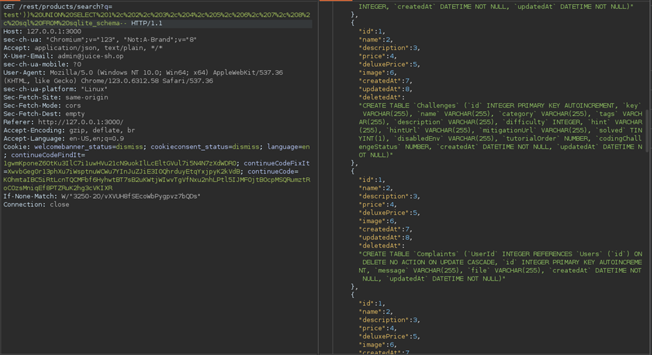
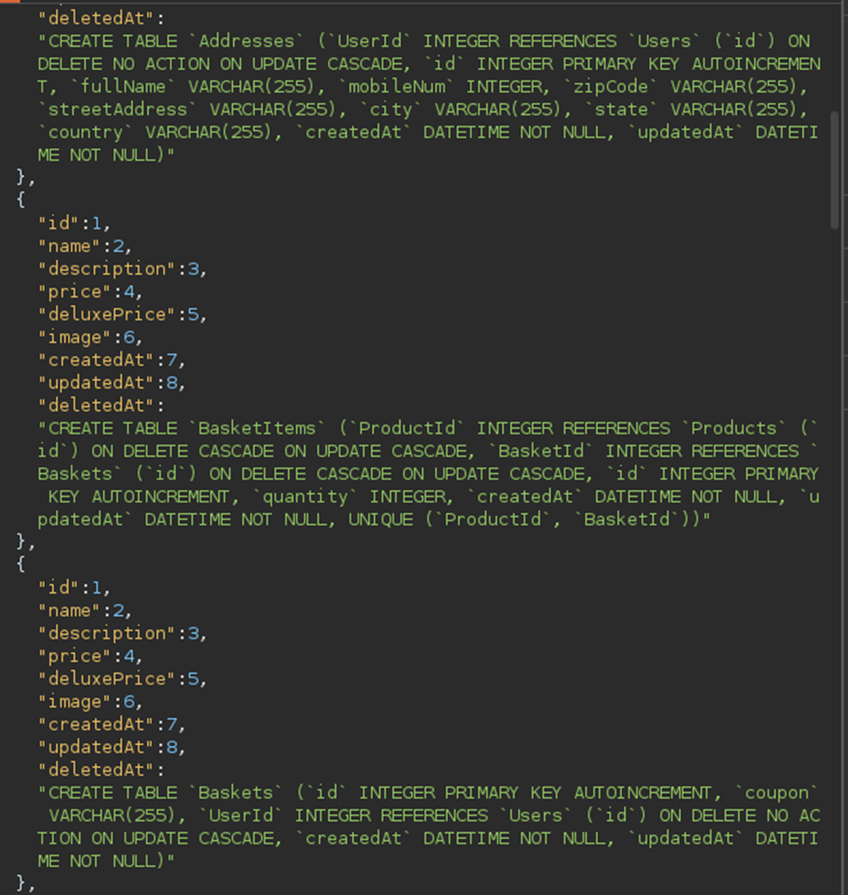
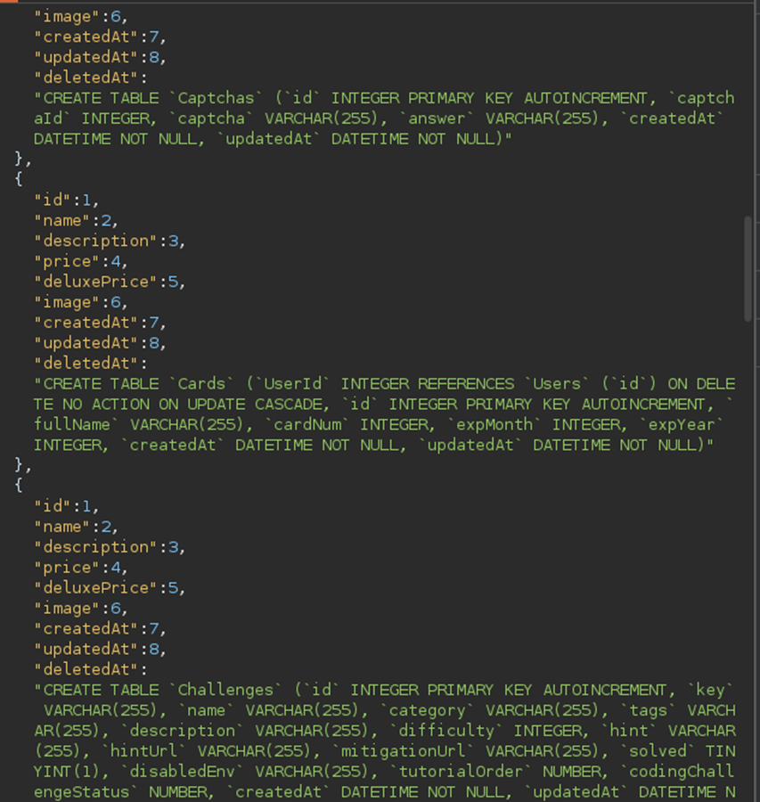
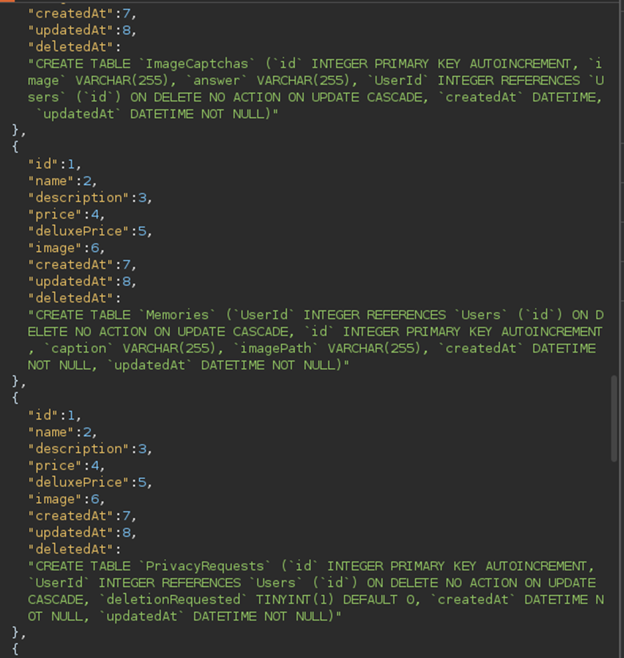
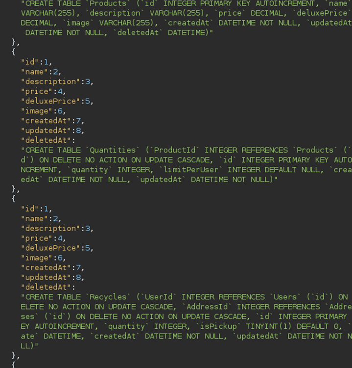
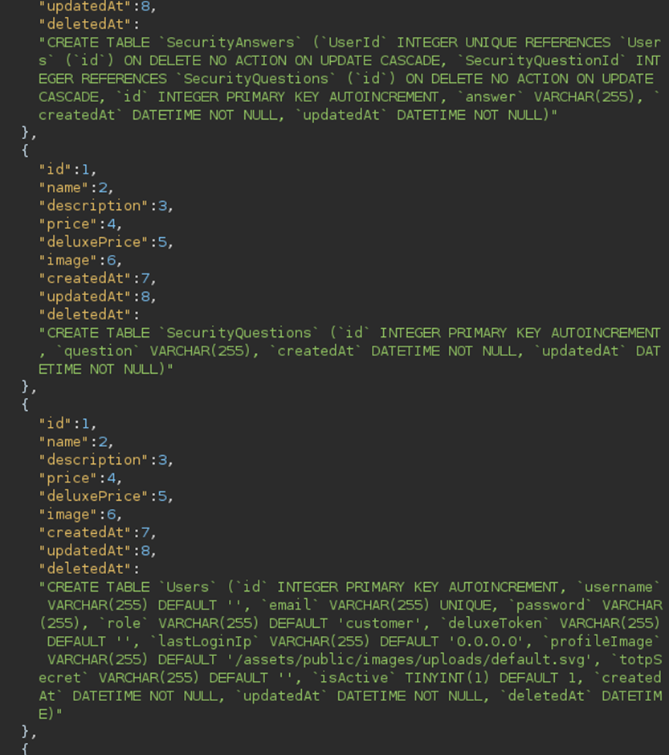
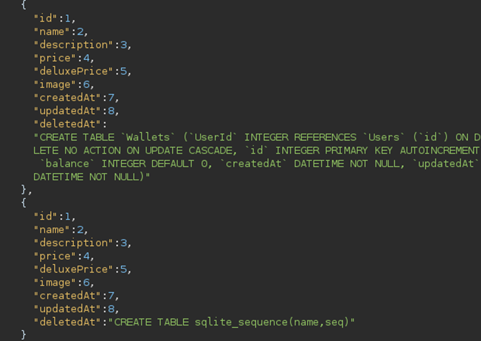

# Juice-Shop Write-up: Database Schema

## Challenge Overview

**Title:** Database Schema\
**Category:** Information Disclosure\
**Difficulty:** ⭐⭐⭐ (3/6)

The "Database Schema" challenge tests skills in extracting the database schema through SQL injection, which can reveal sensitive structural details of the backend database.

## Tools Used

- **Web Browser**: For accessing the web application.
- **HTTP Interception Tool** (e.g., Burp Suite): To intercept and modify HTTP requests for SQL injection.

## Methodology and Solution

### Identifying Injection Points

1. **Finding Vulnerable Endpoint**:
   - Identify a parameter within the application that is susceptible to SQL injection. For this challenge, the product search functionality at `127.0.0.1:3000/rest/products/search?q=payload` is used, where the `q` parameter is vulnerable.

### Crafting the Injection Payload

2. **SQL Injection for Schema Extraction**:
   - Utilize the SQL UNION operator to inject a query that will reveal the database schema. Because the product search results are displayed in a structured format, and it is known that product entries typically have multiple attributes (columns), the SQL injection payload must account for the correct number of columns.
   - Use the payload: `test')) UNION SELECT 1, 2, 3, 4, 5, 6, 7, 8, sql FROM sqlite_schema--` to align with the expected number of columns in the original query and extract schema information from the `sqlite_schema` table.

   

### Extracting the Schema

3. **Executing the Injection**:
   - Submit the crafted payload via the vulnerable parameter. If the number of columns and data types expected by the original SQL query are correctly mirrored in the UNION SELECT injection, the application will display the contents of the database schema within the search results.
   - This result includes critical information about table structures, column details, and sometimes even hints about relationships and constraints.

### Documenting the Results

4. **Recording Schema Information**:
   - Capture and document the output from the SQL injection, which details the database schema. This information is invaluable for understanding the database's layout for further exploitation or analysis.

### Solution Explanation

The challenge was resolved by exploiting a SQL injection vulnerability to extract the schema of the database, a critical step in understanding the underlying structure of the application's data storage mechanism. This not only demonstrates a significant security flaw but also exposes potentially sensitive information that could be used to escalate attacks or breach data.

## Remediation

To prevent similar vulnerabilities:

- **Use Prepared Statements**: Avoid SQL injection by using parameterized queries or prepared statements.
- **Validate and Sanitize Inputs**: Ensure that all user inputs are validated and sanitized to prevent malicious data from affecting SQL queries.

## Database Schema

For future use in others challenges, here is the complete schema of the Juice Shop database :

   

   

   

