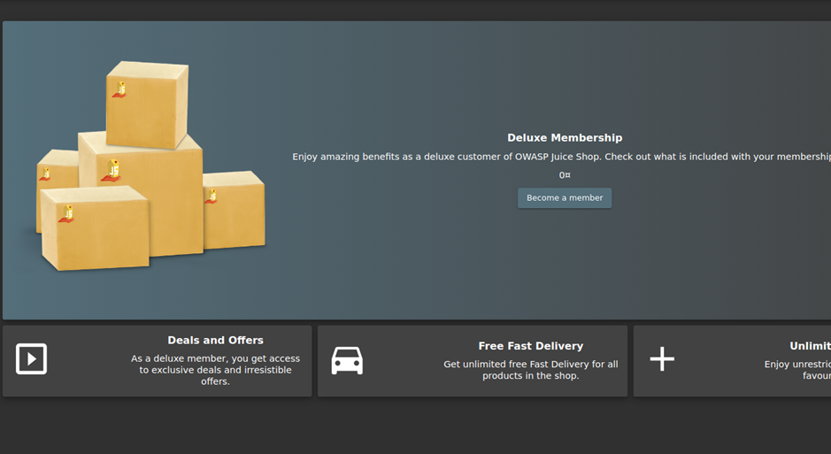

# Juice-Shop Write-up: Deluxe Fraud

## Challenge Overview

**Title:** Deluxe Fraud

**Category:** Improper Input Validation

**Difficulty:** ⭐⭐⭐ (3/6)

The "Deluxe Fraud" challenge involves manipulating the web application to obtain a Deluxe Membership without proper payment. This challenge tests skills in identifying and exploiting vulnerabilities related to payment and authorization mechanisms.

## Tools Used

- **Web Browser**: For navigating to the membership and payment pages and interacting with the application.
- **HTTP Interception Tool** (e.g., Burp Suite): To capture and modify HTTP requests sent from the browser to the server.

## Methodology and Solution

### Initial Access Attempt

1. **Navigating to Deluxe Membership Page**:
   - Accessed the Deluxe Membership page at `http://127.0.0.1:3000/#/deluxe-membership` and was presented with an error message stating the user is not eligible for the membership.

   

### Analyzing the Membership Eligibility Request

2. **Intercepting API Requests**:
   - Used Burp Suite to capture and analyze the HTTP request sent when trying to access the Deluxe Membership. Noticed the response was a "Bad Request" indicating missing or incorrect request parameters.

### Manipulating Payment Process

3. **Exploring Payment Gateway**:
   - Proceeded to the payment page at `http://127.0.0.1:3000/#/payment/deluxe`.
   - Tried to initiate a payment which resulted in another error due to improper or incomplete payment details.

4. **Modifying Payment Details**:
   - Analyzed the request parameters required for the payment which included `paymentMode` and `paymentId`.
   - Experimented with various modifications to `paymentMode` and `paymentId` to bypass the actual payment verification process.

### Successfully Bypassing Payment

5. **Bypassing Payment Verification**:
   - Set `paymentMode` to "none" and `paymentId` to a random or non-existent value to test if the application logic improperly validates these inputs.
   - Successfully bypassed the payment process, simulating the completion of a Deluxe Membership purchase without actual payment.

### Solution Explanation

The challenge was completed by identifying weaknesses in the payment and membership verification processes of the web application. By manipulating request parameters during the payment process, it was possible to simulate a successful transaction without fulfilling the usual payment requirements.

## Remediation

To prevent such vulnerabilities in real-world applications:

- **Enhance Input Validation**: Ensure that all inputs, especially those related to payment operations, are rigorously validated both on the client-side and server-side.
- **Secure Payment Logic**: Implement robust checks on the server-side to verify that payment details are correct and complete before processing transactions.
- **Use Secure Payment Gateways**: Integrate with reputable payment gateways that provide additional security checks and validations.
- **Regular Security Audits**: Conduct periodic security audits and penetration tests to identify and mitigate vulnerabilities related to financial transactions and user access controls.

This challenge underscores the importance of robust input validation and secure payment processing mechanisms to prevent fraudulent activities and ensure the integrity of financial transactions within web applications.