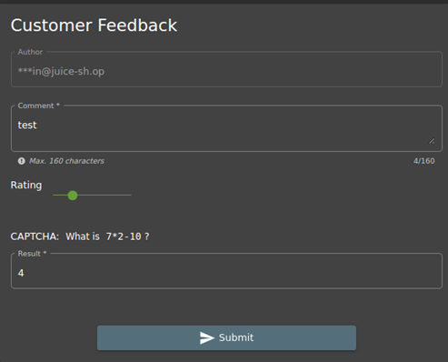
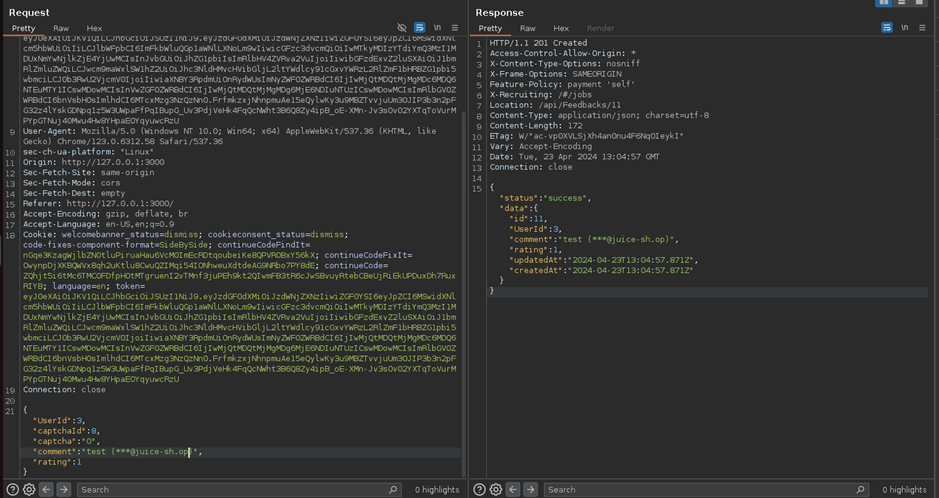

# Juice-Shop Write-up: Forged Feedback Challenge

## Challenge Overview

**Title:** Forged Feedback\
**Category:** Broken Access Control\

**Difficulty:** ⭐⭐⭐ (3/6)

This challenge involves exploiting insufficient access controls to post feedback under another user's name, illustrating vulnerabilities related to user identity management within a web application.

## Tools Used

- Burp Suite (for intercepting and manipulating HTTP requests)

## Methodology and Solution

### Understanding the Application's Feedback Mechanism

1. **Submit Feedback**: Initially, submit feedback normally through the application's interface to understand how the feedback submission process works.

2. **Intercept the Request**: Using Burp Suite, capture the HTTP request sent when feedback is submitted. Analyze the request to understand its structure and the parameters it includes.

### Exploiting the Vulnerability

1. **Identify User Identification Mechanism**: Note that the feedback submission request includes a user identifier, likely an "user_id" or similar parameter, which the application uses to attribute the feedback to a specific user.

2. **Manipulate User Identifier**:
   - Modify the "user_id" parameter in the intercepted request to the ID of another user, preferably a user with higher privileges like an admin, to test if the application enforces proper authorization checks.

   
   
   - Resend the modified request to see if the feedback gets posted under the changed user ID.

3. **Verify the Outcome**: Check the application to confirm whether the feedback appears under the other user's profile or feedback history.

## Solution Explanation

The challenge was successfully resolved by manipulating the user identifier in the feedback submission process. This was possible because the server failed to validate whether the user submitting the feedback was the same as the user ID specified in the request. This type of vulnerability is indicative of broken access control mechanisms where the application does not adequately verify the user's identity or permissions before performing actions on their behalf.

## Remediation

To prevent such issues in real applications, consider the following security measures:

- **Enhanced Server-Side Validation**: Ensure that all sensitive actions, such as posting feedback, include server-side checks to confirm that the user associated with the session is the same as the user the action is being performed for.
- **Use Session Management**: Implement secure session management practices that map session IDs to user IDs securely. Actions should be authorized based on session ownership rather than relying on user-provided data like user IDs in the request.
- **Audit and Monitoring**: Regularly audit user activities and access controls to detect and respond to unauthorized actions, ensuring that any anomalies are quickly identified and mitigated.
- **Role-Based Access Control (RBAC)**: Enforce RBAC to ensure that users can only perform actions that correspond to their roles and permissions.
