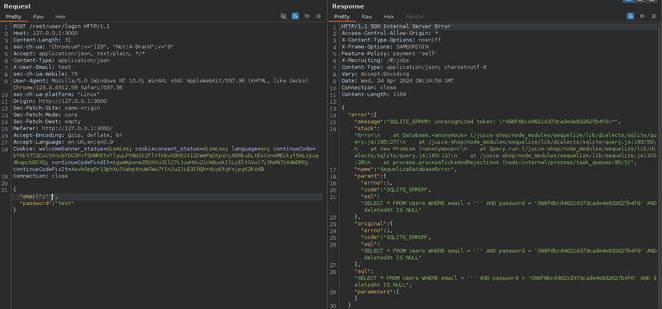
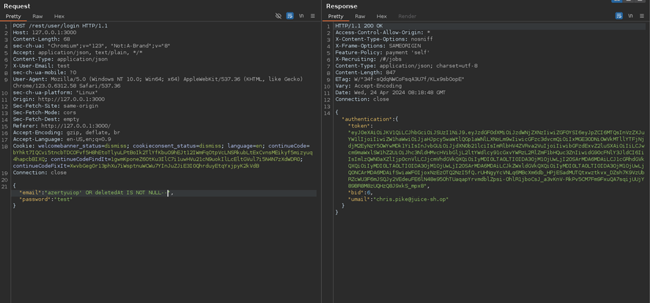

# Juice-Shop Write-up: GDPR Data Erasure

## Challenge Overview

**Title:** GDPR Data Erasure\
**Category:** Broken Authentication\
**Difficulty:** ⭐⭐⭐ (3/6)

The "GDPR Data Erasure" challenge requires to access an account that has been marked as deleted in compliance with GDPR requirements, which stipulates the right to erasure. 

## Tools Used

- **Web Browser**: For interacting with the login page.
- **HTTP Interception Tool** (e.g., Burp Suite): To capture and modify HTTP requests to inject SQL commands.

## Methodology and Solution

### Identifying Vulnerability

1. **SQL Injection Discovery**:
   - Initially, attempt to log in with a normal user email and password. Notice that introducing a single quote in the email field (`'`) triggers a SQL error, indicating potential for SQL injection.

### Crafting the Injection

2. **Analyzing SQL Error Output**:
   - The error message leaked by the SQL server hints at the query structure, specifically showing how the application checks for a non-null `DeletedAt` field to determine if an account is considered deleted.

   

3. **Injecting SQL to Target Deleted Accounts**:
   - Modify the login request to include an SQL injection payload that alters the query logic to return an account where `DeletedAt` is NOT NULL. This payload could look like: `' OR DeletedAt IS NOT NULL --`.

   

### Gaining Unauthorized Access

4. **Executing the Injection**:
   - Input the crafted payload into the email field and observe the server's behavior.
   - The manipulated query effectively bypasses the application's normal user authentication and authorization process, logging into the first account it finds with a non-null `DeletedAt` field, which turns out to be Chris's account.

### Solution Explanation

The challenge was successfully resolved by exploiting an SQL injection vulnerability in the login form. By crafting a query that ignored the intended logic of only allowing access to accounts with a null `DeletedAt` field, access was gained to an account marked as deleted, demonstrating a critical security flaw.

## Remediation

To prevent such vulnerabilities and secure user data, especially in compliance with GDPR:

- **Prepared Statements**: Use prepared statements with bound, typed parameters to prevent SQL injection.
- **Enhanced Login Security**: Implement multi-factor authentication to reduce the risk of unauthorized access.
- **Proper Account Handling**: Ensure that account deletion or deactivation processes are robust and do not leave loopholes that could allow deleted accounts to be accessed.
