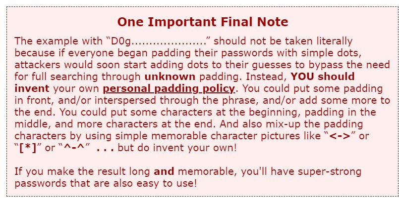
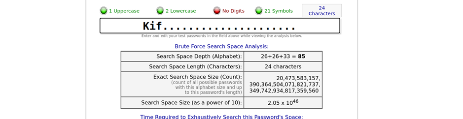
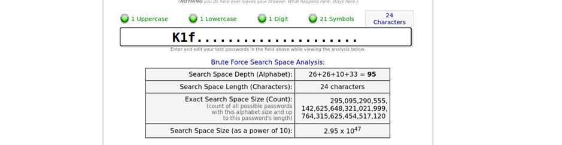

# Juice-Shop Write-up: Login Amy

## Challenge Overview

**Title:** Login Amy\
**Category:** Brute Force / Cryptographic Issues\
**Difficulty:** ⭐⭐⭐ (3/6)

The "Login Amy" challenge involves using clues related to a fictional character to determine the password and gain access to the account. 

## Tools Used

- **Web Browser**: For accessing the password strength estimation tool and manipulating password guesses.
- **Password generator** : https://www.grc.com/haystack.htm?1

## Methodology and Solution

### Understanding the Cultural Reference

1. **Futurama Reference**:
   - Amy Wong, a character from Futurama, dates a character named Kif Kroker. Knowing this relationship provides a clue that "Kif" could be part of her password.

### Utilizing the Password Strength Estimation Tool

2. **Estimating Password Strength**:
   - Use the URL provided in the hint ([GRC's Haystack](https://www.grc.com/haystack.htm)) to input various iterations of a password based on the name "Kif" to gauge how long it would take to brute force it.
   - Adjust the password length and characters, using digits and special characters alongside the name to match the hinted duration for brute force resistance.

### Crafting the Password

3. **Formulating the Password**:

   - We know by reading the hint of the challenge that she didn't follow the "one important final note" that states that people must not fill their password using dots : 

   

   - Based on the tool's feedback and the challenge's hint about a significant brute force duration ("93 billion trillion trillion centuries"), incrementally increase the complexity and length of the password until reaching a calculation that closely matches this duration.

   

   - Discover that a 24-character password matche this duration.

   - Starting by "K1f" (replacing 'i' with '1') and filled with additional dots provides the expected brute force resistance.

   

### Attempting to Login

4. **Testing the Password**:
   - Input the crafted password on the login page for Amy's account to see if it grants access.

### Solution Explanation

The challenge was solved by combining knowledge of Futurama, hints about password practices, and using a password strength calculator to approximate a highly secure password. The key was in using the name "Kif" appropriately modified and extended to reach the required security threshold, suggesting Amy's password was "K1f......................." (with 21 dots).

## Remediation

To secure against such vulnerabilities in real-world scenarios:

- **Educate Users on Password Security**: Inform users about creating strong, memorable passwords that do not simply rely on predictable patterns or easily guessed cultural references.
- **Implement Rate Limiting and Account Lockout Mechanisms**: Prevent brute force attacks by limiting the number of failed login attempts.
- **Use Multi-Factor Authentication (MFA)**: Enhance security by requiring additional verification beyond just a password.
