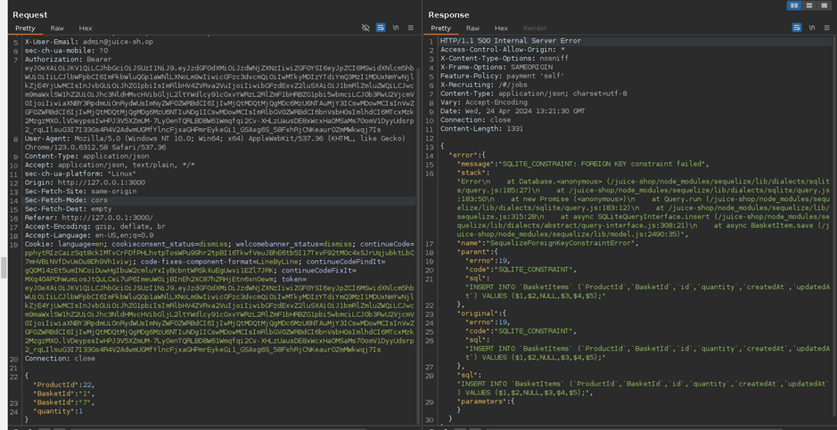
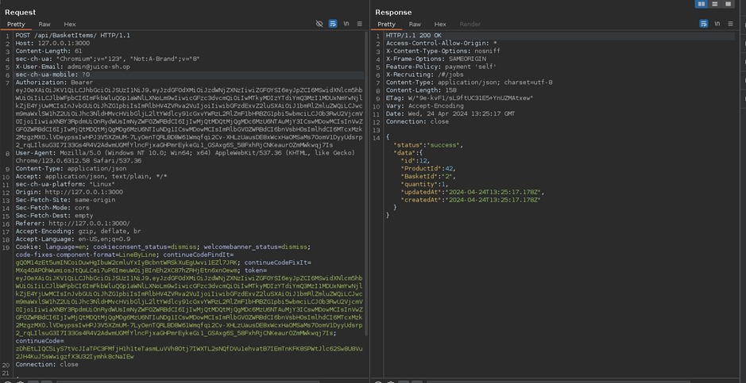

# Juice-Shop Write-up: Manipulate Basket

## Challenge Overview

**Title:** Manipulate Basket\
**Category:** Broken Access Control\
**Difficulty:** ⭐⭐⭐ (3/6)

The "Manipulate Basket" challenge involves adding an item to another user's shopping basket by exploiting potential insecure direct object references (IDOR) vulnerabilities in the application.

## Tools Used

- **Web Browser**: Used to interact with the web application and inspect network requests.
- **Burp Suite**: Used to intercept, modify, and resend HTTP requests.

## Methodology and Solution

### Exploring the Basket Functionality

1. **Initial Testing**:
   - Add a product to the personal basket to observe the HTTP request structure and parameters involved.
   - Identify that each basket operation (add, modify) is referenced by a specific basket ID, which is tied to an user.

### Identifying the Vulnerability

2. **Request Manipulation**:
   - Intercept the request where a product is added to the basket using Burp Suite.
   - Notice that the basket ID (BasketId) is included in the request body, indicating a potential vector for IDOR.

### Exploiting the IDOR Vulnerability

3. **Manipulating the Basket ID**:
   - I initially tried to change the `BasketId` in the intercepted request to another user's basket ID to test for direct object reference issues.
   - But I encounter access control checks that prevent adding items to a basket not owned by the user.

   

### Bypassing the Security Check

4. **Double Parameter Injection**:
   - Attempt to bypass the security mechanism by duplicating the `BasketId` parameter in the request body (overload).
   - First encountered an error, but it means that something is happening :

   

   - So I keep trying this way and I figured out that the server processes only the first `BasketId` for the security check but uses the second `BasketId` for the operation, successfully adding the item to another user's basket :

   

### Confirming the Exploit

5. **Verification**:
   - Send the manipulated request and receive a successful response.
   - Verify by checking the targeted user's basket if the item was added successfully.

### Solution Explanation

The challenge was solved by identifying and exploiting a flaw in the handling of HTTP request parameters, where the application failed to properly secure basket operations against unauthorized modifications. By inserting a duplicated `BasketId` parameter, it was possible to bypass the server's initial security check and manipulate another user's basket contents.

## Remediation

To prevent such vulnerabilities in real-world applications:

- **Ensure Proper Parameter Handling**: Servers should be designed to handle unexpected, duplicated, or out-of-order parameters securely.
- **Implement Robust Access Controls**: Ensure that all sensitive operations verify the user's permission to perform the action on the specified resource.
