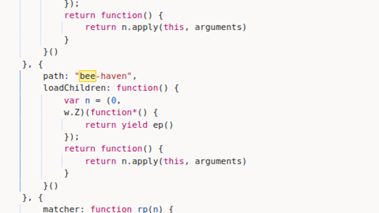
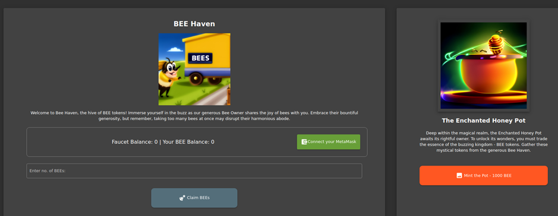
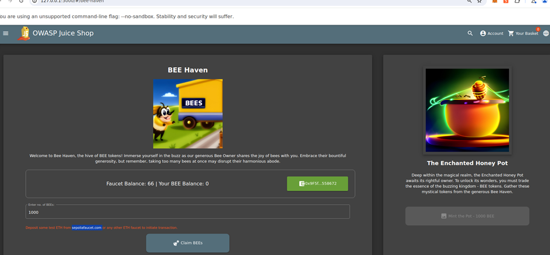
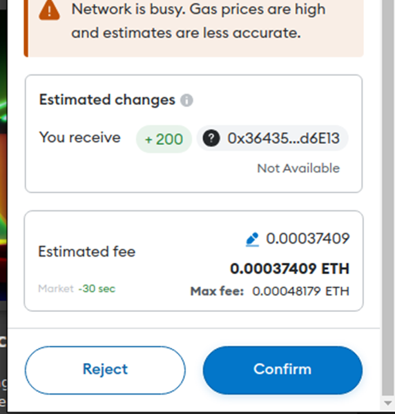
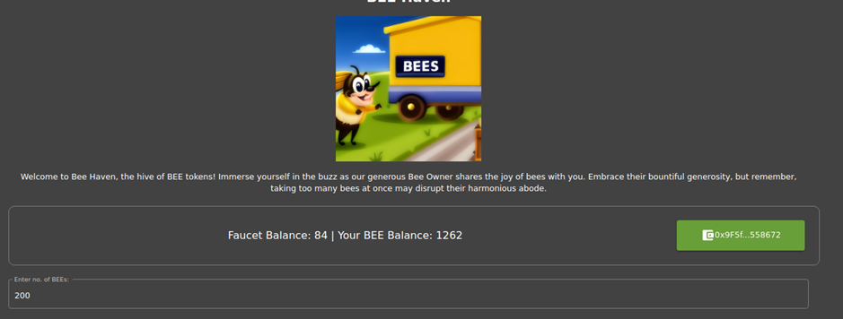
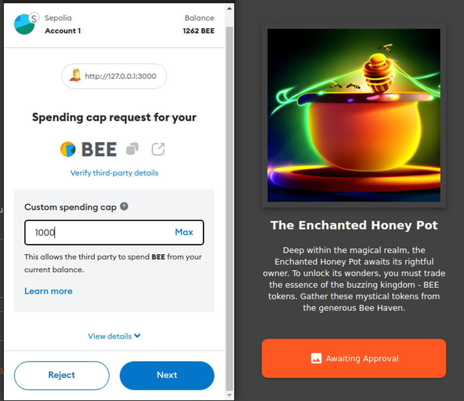

# Juice-Shop Write-up: Mint the Honey Pot

## Challenge Overview

**Title:** Mint the Honey Pot  
**Category:** Improper Input Validation  
**Difficulty:** ⭐⭐⭐ (3/6)

This challenge involves accumulating a digital currency known as BEEs from the "Bee Haven" in the OWASP Juice Shop to mint a Honey Pot NFT.

## Tools Used

- **MetaMask**: A browser extension used to manage Ethereum wallet, necessary for handling blockchain transactions.
- **Web Browser**: Used to access and interact with the OWASP Juice Shop application.

## Methodology and Solution

### Step 1: Accessing the "Bee Haven"

1. **Navigate to the Bee Haven**:
   - Find the page path by searching "bee" in main.js :

   

   - Access the Bee Haven within the OWASP Juice Shop by navigating to the `/bee-haven` path as discovered in the main.js routing setup.

   

### Step 2: Gathering BEES

2. **Claim BEES**:
   - Initially, attempt to claim 1000 BEES by clicking the claim button on the Bee Haven page.
   - The application prompts for depositing ETH from a testnet faucet to claim BEES, indicating the requirement of blockchain interaction.

   

### Step 3: Overcoming Faucet Challenges

3. **Obtaining Test ETH**:
   - Since traditional faucets require prior wallet activity, I struggle to find a website that allow to get faucet ETH.
   - I finally find a website that allows obtaining test ETH without prerequisites.

   

   - Execute transactions using the obtained test ETH to activate the ability to claim BEES.

   

### Step 4: Minting the Honey Pot NFT

4. **Minting the NFT**:
   - After accumulating 1000 BEES through the Bee Haven functionality and interacting with the blockchain, click on the Mint button to create the Honey Pot NFT.

   
   
   - Verify that the NFT has been successfully minted and added to your blockchain assets.

