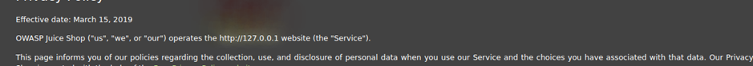
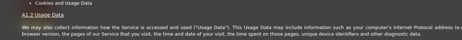
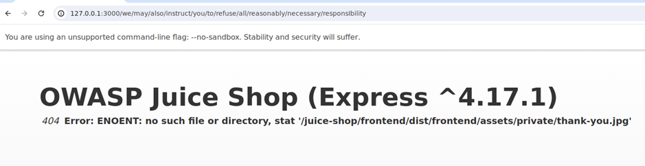

# Juice-Shop: Privacy Policy Inspection

## Challenge Overview

**Title:** Privacy Policy Inspection

**Category:** Security through Obscurity

**Difficulty:** ⭐⭐⭐ (3/6)

The "Privacy Policy Inspection" challenge requires to demonstrate their familiarity with the privacy policy by uncovering hidden elements or messages within the policy document.

## Tools Used

- **Web Browser**: To access the privacy policy page and navigate hidden links.
- **Analytical Skills**: For detailed reading and identifying obscured information within the text.

## Methodology and Solution

### Locating the Privacy Policy

1. **Accessing the Policy**:
   - Use a crawler and a website to map it.
   - The crawler (for example BurpSuite) will find this URL : `http://127.0.0.1:3000/#/privacy-security/privacy-policy` 
   - Use it to access the Privacy Policy of the application.

    

### Examining the Document

2. **Detailed Inspection of the Policy**:
   - Thoroughly read through the privacy policy, paying close attention to any out-of-place or unusual wording, formatting, or embedded hyperlinks.

### Discovering Hidden Elements

3. **Identifying Hidden Triggers**:
   - During the examination, notice that hovering over certain sections or words in the policy triggers overlay pop-ups or reveals hidden messages.

    
    

   - Piece together these words or phrases to form a path or message that might indicate a hidden URL or document.

    

### Accessing Hidden Content

4. **Following Clues**:
   - Previous URL will give you an error message, but the message include another path.
   - Specifically, navigate to `/juice-shop/frontend/dist/frontend/assets/private/thank-you.jpg` as hinted by the error message or document overlay.

### Verifying Challenge Completion

5. **Confirming Access to Hidden Content**:
   - Successfully accessing the hidden content or page confirms that the privacy policy was thoroughly inspected, fulfilling the challenge criteria.

### Solution Explanation

The challenge was completed by meticulously reading the privacy policy and identifying embedded clues that led to a hidden resource.

## Remediation

Not applicable to any real-world applications.
