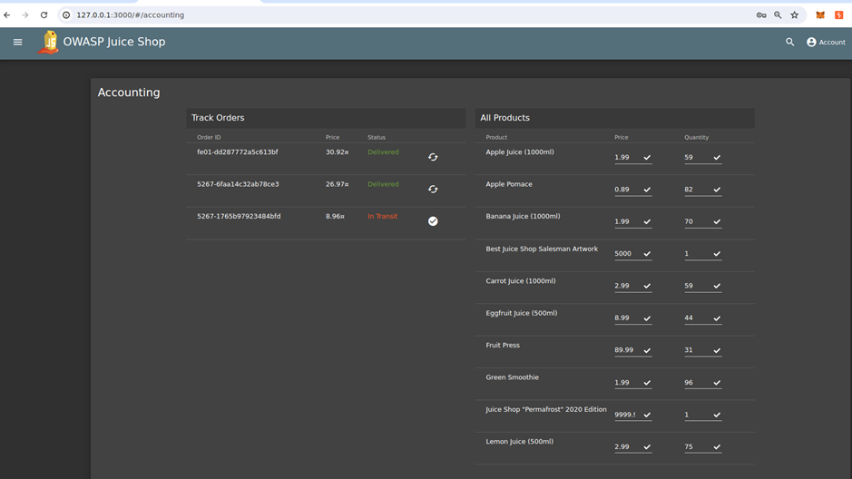
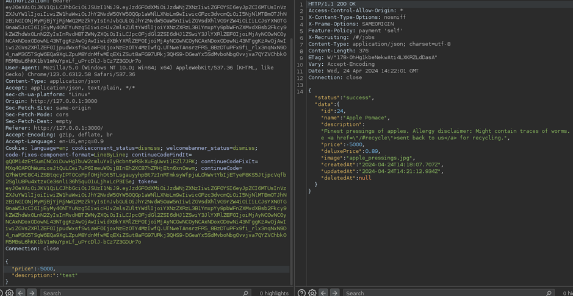
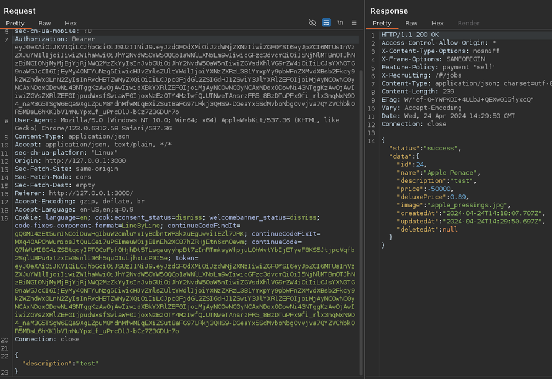
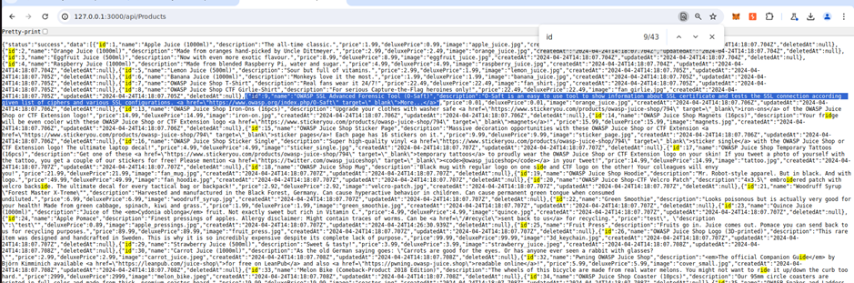

# Juice-Shop Write-up: Product Tempering

## Challenge Overview

**Title:** Product Tempering\
**Category:** Broken Access Control\
**Difficulty:** ⭐⭐⭐ (3/6)

The challenge, "Product Tempering," involves changing the href attribute of a hyperlink within the product description of the "OWASP SSL Advanced Forensic Tool (O-Saft)" to point to a new URL: `https://owasp.slack.com`.

## Tools Used

- **Web Browser**: To navigate the application and interact with product management features.
- **Burp Suite** : To modify and resend HTTP requests to the server.

## Methodology and Solution

### Identifying the Injection Point

1. **Access Control Check**:
   - Navigate to the accounting section where products can be updated, indicating a possible lack of strict access controls on who can modify product details.

   

### Attempting the Update

2. **Capture and Analyze HTTP Requests**:
   - Capture the request sent when updating a product description using developer tools or Burp Suite.
   - Initial attempts to modify the description by overiding it did not reflect changes, suggesting backend validation or filtering of input.

   
    
### Exploring API Endpoints

3. **API Endpoint Discovery**:
   - Use the browser or a tool to list all product details by accessing the `/api/Products` endpoint.
   - Identify the specific product ID for the "OWASP SSL Advanced Forensic Tool (O-Saft)" from the JSON response.
   - Identify that this endpoint is vulnerable to description override :

   

### Successful Payload Delivery

4. **Constructing the Successful Payload**:
   - Construct a JSON payload with the `description` field altered to include the new hyperlink: `<a href="https://owasp.slack.com" target="_blank">More...</a>`.
   - Submit the modified payload to the API endpoint responsible for updating product details, e.g., `/api/Products/[ID]`, using the correct product ID.

   

### Verifying the Result

5. **Verification**:
   - Check the product description in the application to ensure that the hyperlink has been changed as intended.
   - Confirm that the link points to the new target URL, `https://owasp.slack.com`.

## Conclusion

Successfully changing the product link indicates a critical flaw in how user input is handled and validated on the server side, allowing unauthorized modifications to product details. This type of vulnerability can lead to misinformation, phishing attacks, or other malicious outcomes if exploited by an attacker.

## Remediation

To prevent such vulnerabilities:

- **Implement Strict Role-Based Access Controls (RBAC)**: Ensure that only authorized personnel can modify product details.
- **Sanitize and Validate All Inputs**: Properly sanitize and validate all user inputs, especially in product descriptions that allow HTML content.
