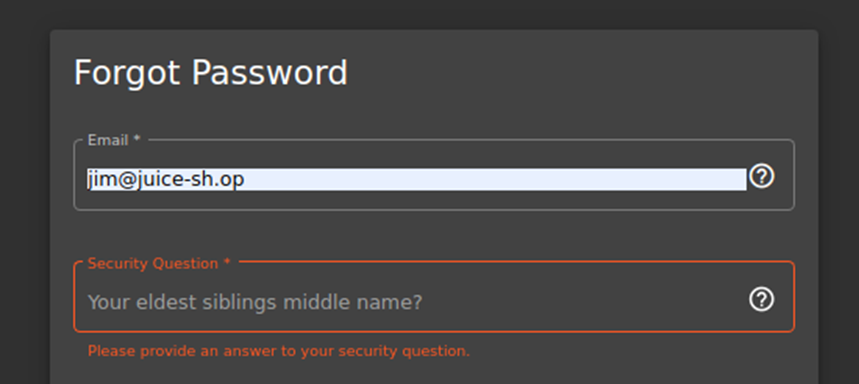
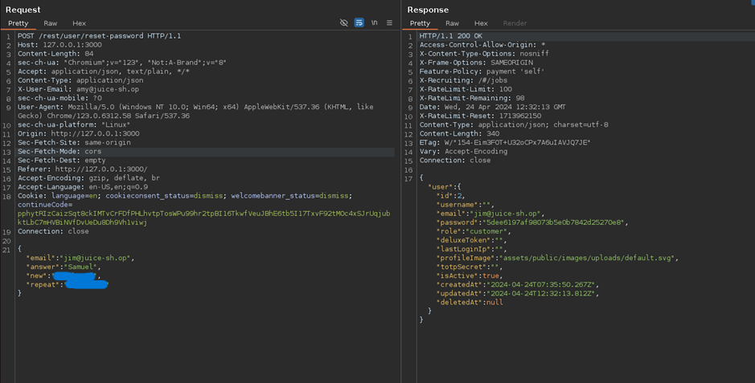

# Juice-Shop Write-up: Reset Jim's Password

## Challenge Overview

**Title:** Reset Jim's Password\
**Category:** OSINT\
**Difficulty:** ⭐⭐⭐ (3/6)

The "Login Jim" challenge tasks us to reset the Jim's password using the answer of his security question.

## Tools Used

- **Web Browser**: For conducting online searches to gather information about the character.

## Methodology and Solution

### Researching the Character

1. **Identifying Jim's Identity**:
   - Given that the challenge hint refers to Jim as a celebrity whose answer to his security question can be found publicly.
   - In a comment, Jim quote a line from Star Trek.
   - So we know that there's maybe a connection to "Star Trek", so we search for "Jim Star Trek".
   - Discover that Jim refers to James Tiberius Kirk from "Star Trek".

### Analyzing Security Question

2. **Security Question Details**:
   - here is the security question of Jim :
   
   

### Gathering Relevant Information

3. **Exploring Family Connections**:

   - Search for information about James T. Kirk's family to find relevant answers for the security question.

   

   - Find that his brother's name is George Samuel Kirk

### Accessing the Account

4. **Testing the Security Answer**:
   - Use the name "George Samuel Kirk" as the answer to the security question in the account recovery or login process :

   

### Solution Explanation

This challenge was resolved by recognizing the fictional identity of Jim as Captain James T. Kirk from "Star Trek".

## Remediation

To prevent similar security issues in real-world applications:

- **Choose Robust Security Questions**: Avoid questions where answers are easily guessed or found. Use questions that have safe, unpredictable answers. If possible, remove security question and replaces them by an email sended to users when they want to reset their password.
- **Educate Users**: Guide users in selecting security questions and answers that are secure, emphasizing the risk of using easily accessible information.
- **Implement Multiple Authentication Factors**: Enhance security by requiring multiple methods of authentication beyond security questions.
