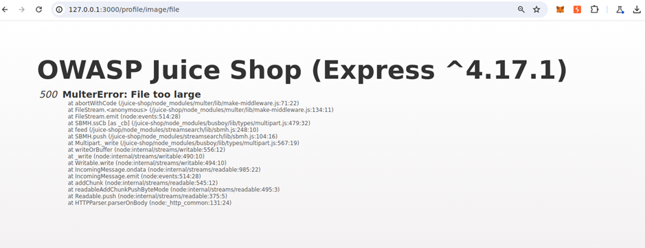
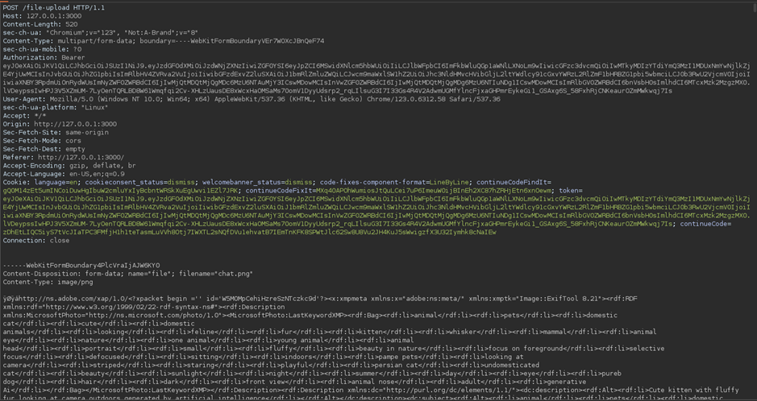
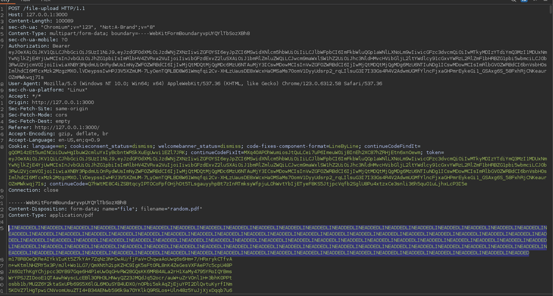

# Juice-Shop Write-up: Upload Size

## Challenge Overview

**Title:** Upload Size\
**Category:** Improper Input Validation\
**Difficulty:** ⭐⭐⭐ (3/6)

The "Upload Size" challenge requires uploading a file larger than 100 KB, which is beyond the size limit enforced by the application's client-side validation.

## Tools Used

- **Web Browser**: For navigating the web application and manipulating file uploads.
- **Burp Suite**: To intercept, modify, and resend HTTP requests to bypass client-side restrictions.

## Methodology and Solution

### Initial Attempt

1. **Testing File Upload**:
   - Attempt to upload a file larger than 100 KB directly through the profile image upload functionality.

   

   - Encounter an error: `MulterError: File too large`, indicating server-side enforcement of the file size limit.

   

### Analyzing the Application

2. **Exploring Alternative Upload Points**:
   - Redirect focus to the complaint page as hinted, where file uploads are also supported.
   - Discover that this page only superficially restricts file sizes through client-side JavaScript, making it a potential vector for bypassing the restriction.

### Crafting the Payload

3. **Creating an Edge Case File**:
   - Generate a file just under the 100 KB limit using the linux command: `base64 /dev/urandom | head -c 99900 > random.pdf`.

### Exploiting the Server-Side Check

4. **Modifying the Request**:
   - Upload the `random.pdf` and intercept the HTTP request using Burp Suite.

   

   - Modify the intercepted request by duplicating the content within the file payload to push the size over 100 KB.

   

### Bypassing the Size Limit

5. **Resend the Modified Request**:
   - Send the modified request with the now larger file size.
   - Successfully bypass the server-side file size check, as indicated by the successful upload response from the server.

### Solution Explanation

The challenge was resolved by exploiting a weakness in the server's file size checking mechanism, where only initial file sizes are validated client-side, and server-side checks can be bypassed through request modification. This highlights a common security oversight where server-side validations do not robustly re-check parameters that could be tampered with after client-side checks.

## Remediation

To prevent such vulnerabilities in real-world applications:

- **Implement Robust Server-Side Validation**: Ensure that all input validations, including file sizes, are re-checked on the server after being submitted.
- **Limit Input Modification**: Use multipart/form-data parsing libraries that strictly enforce total payload sizes, rather than relying on client-side enforcement.
