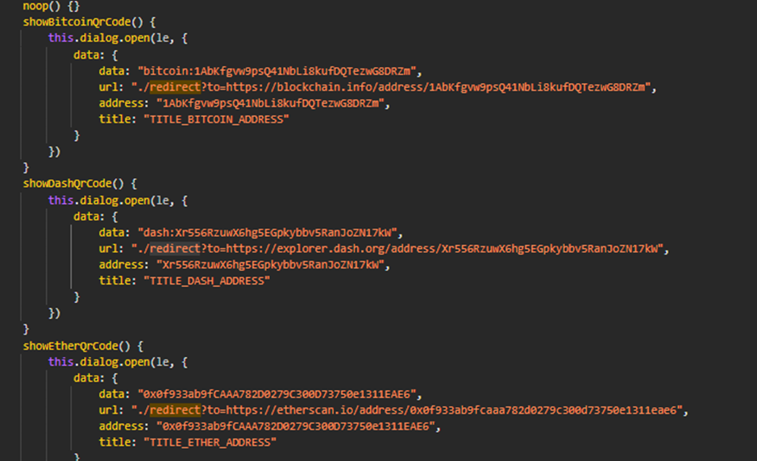
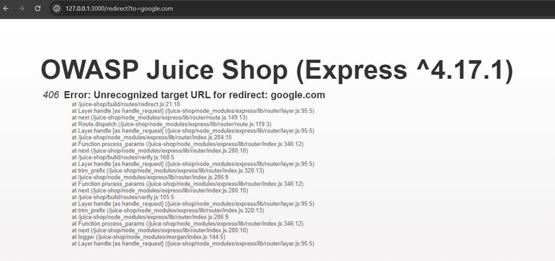

# Juice-Shop Write-up: Allowlist Bypass

## Challenge Overview

**Title:** Allowlist Bypass\
**Category:** Broken Access Control\ 
**Difficulty:** ⭐⭐⭐⭐ (4/6)

This challenge required bypassing the allowlist functionality of URL redirection implemented in the OWASP Juice Shop application.

## Tools Used

- **Browser**: Utilized to test various URL redirection and observe behaviors.
- **Code Editor**: Analyzed the source code to understand the redirection mechanism.

## Methodology and Solution

### Step 1: Exploring Redirect Functionality

1. **Initial Exploration**:
   - Started by reviewing the `main.js` for how redirects are managed and handled within the application. To do this, I searched for "review" keyword. This revealed the basic form of the redirection URL as `127.0.0.1:3000/redirect?to=targetURL`.
   
   

### Step 2: Testing and Understanding Allowlist

2. **Testing with Non-Allowlisted URL**:
   - Used a common external URL (google.com) to test the redirect functionality. This attempt was blocked, confirming the presence of an allowlist mechanism.

   

   - The error pointed to the location of the allowlist check in the source code (`/juice-shop/build/routes/redirect.js`), providing a potential file path for further investigation.

### Step 3: Bypassing the Allowlist

3. **Initial Bypass Attempts**:
   - Several methods were tried, including adding known allowlisted URLs to the query parameter and appending unallowed URLs, injecting null bytes, and other common URL bypass techniques—all to no avail.

### Step 4: Refinement of Bypass Technique

4. **Successful Allowlist Bypass**:
   - Changed approach by crafting a personal website that redirects to another URL. Hypothesized that the validation might only be checking the presence of allowlisted URLs within the entire string.
   - Constructed the URL `https://estebanmagnon.com/redirect/?to=https://blockchain.info/address/1AbKfgvw9psQ41NbLi8kufDQTezwG8DRZm`, which includes a redirection through a personal site to an allowlisted destination.
   - Tested this URL in the format `127.0.0.1:3000/redirect?to=https://estebanmagnon.com/redirect/?to=https://blockchain.info/address/1AbKfgvw9psQ41NbLi8kufDQTezwG8DRZm` and successfully bypassed the allowlist restriction.

## Solution Explanation

The allowlist bypass was achieved by exploiting the mechanism's check for an allowlisted URL anywhere within the redirect query parameter. By nesting the redirection such that it passed through an intermediate site before redirecting to an allowlisted site, the security check was fooled into allowing an otherwise restricted URL. This method illustrates the potential for sophisticated bypass techniques when only partial URL validation is employed.

### Security Recommendations

- **Validate Full URL**: Implement comprehensive URL validation checks that consider the entire URL path and parameters, not just partial matches.
- **Use More Robust Redirect Mechanisms**: Avoid relying solely on client-side checks for critical security functionalities like URL redirections.
