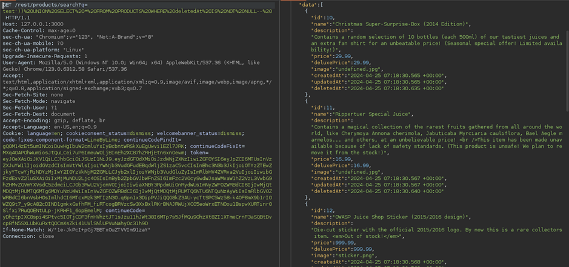
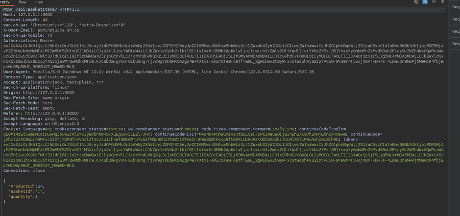
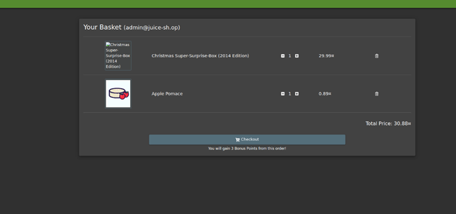

# Juice-Shop Write-up: Christmas Offer

## Challenge Overview

**Title:** Christmas Offer\
**Category:** Injection\
**Difficulty:** ⭐⭐⭐⭐ (4/6)

The goal of this challenge was to exploit an SQL Injection to access a hidden Christmas offer product that was presumably removed or hidden from the normal product listing (marked as deleted in the database).

## Tools Used

- **Web Browser**: For interacting with the Juice Shop web interface.
- **Developer Tools**: To monitor and modify network traffic.

## Methodology and Solution

### Step 1: Identifying the Injection Point

1. **Using the Product Search**:
   - The search functionality on `127.0.0.1:3000/rest/products/search?q=payload` was identified as an SQL injection point, similar to previous challenges involving user data extraction.

### Step 2: Crafting the SQL Injection Query

2. **Exploiting the Search Feature**:
   - Initiated an SQL injection with the query `test')) UNION SELECT * FROM PRODUCTS WHERE deletedAt IS NOT NULL--`.

   

   - This was based on the hypothesis that hidden or special products like the Christmas offer might be flagged as deleted in the system.

### Step 3: Retrieving the Product ID

3. **Extracting Hidden Product Details**:
   - The SQL Injection successfully returned details of products that were not visible in the regular product listings, including the Christmas offer.
   - The `productId` for the Christmas offer was discovered to be `10`.

### Step 4: Adding the Product to the Cart

4. **Manipulating the Cart**:
   - Add a product in shopping cart and capture request using Burp :

   

   - Then I added to the shopping cart the special product by setting the `ProductId` to `10` in the POST request:

   

## Solution Explanation

This challenge was resolved by utilizing an SQL Injection within the product search API to uncover hidden products. By injecting SQL that queried for products with a non-null `deletedAt` field, the Christmas offer product was revealed. The `productId` obtained through this injection was then used to add the product to the shopping cart, bypassing normal browsing and selection mechanisms.

### Security Measures

To mitigate such vulnerabilities:
- **Proper Input Validation and Sanitization**: Ensuring that all inputs undergo proper validation and sanitization can prevent SQL injection attacks.
- **Use of Parameterized Queries**: This prevents SQL injection by separating SQL logic from the data being input.
- **Visibility and Access Controls**: Avoid logical deletions (marking items as deleted), ensure that it do not leave data accessible (it must really erase data).
