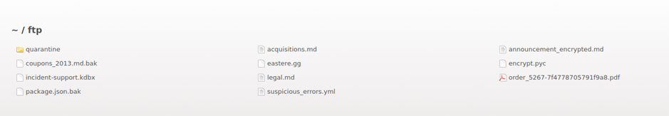
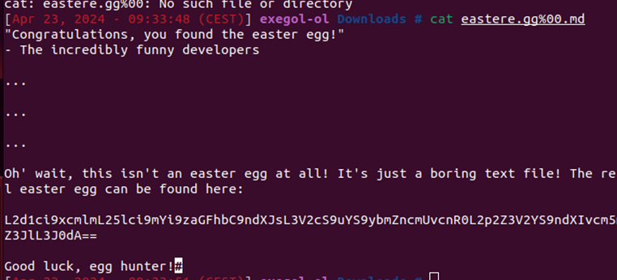

# Juice-Shop Write-up: Find the Easter Egg

## Challenge Overview

**Title:** Easter Egg\
**Category:** Broken Access Control\
**Difficulty:** ⭐⭐⭐⭐ (4/6)

The challenge involved discovering a hidden Easter egg within the application, requiring exploration of the application's directory structure and clever manipulation to access restricted file types.

## Tools Used

- **Web Browser**: Used to navigate and explore the application’s FTP directory.
- **Command-Line Interface (CLI)**: Utilized to execute commands and handle file operations.
- **Base64 Decoder**: To decode encoded text.

## Methodology and Solution

### Step 1: Exploring the FTP Server

1. **FTP Directory Access**:
   - Navigate to `127.0.0.1:3000/ftp` using a web browser to access the server’s FTP directory, which revealed various files including `eastere.gg`.

   

### Step 2: Circumventing File Access Restrictions

2. **Null Byte Poisoning**:
   - Identify that only `.pdf` or `.md` files are downloadable directly through the interface.
   - Attempt to access the `eastere.gg` file by manipulating the URL to include a null byte followed by an allowed file extension. Example: Accessing `eastere.gg%2500.pdf` tricks the system into bypassing the extension check, allowing the download of a non-.pdf/.md file.

   

### Step 3: Accessing and Decoding the Easter Egg

3. **File Download and Examination**:
   - Successfully download the `eastere.gg` file using the manipulated URL.
   - Open the file to discover it contains text suggesting another layer to the Easter egg challenge, providing a Base64 encoded string.

   

### Step 4: Decoding the Hidden Message

4. **Decode the Encoded String**:
   - Decode the Base64 string to reveal further information or a hidden message pertaining to the next challenge or Easter egg.

## Solution Explanation

The core challenge was to bypass the file access restrictions set by the application, which limited downloads to .pdf and .md files. By exploiting the server’s poor handling of file extensions through null byte poisoning, the restricted file eastere.gg was accessed. 

The decoded message inside eastere.gg served as a gateway to understanding another hidden layer, likely leading to additional challenges or rewards in the context of the Juice-Shop application. 

## Remediation

To prevent such issues in real-world applications:
- **Validate File Extensions Server-Side**: Ensure that file extension checks are implemented securely on the server side without relying on URL parsing alone.
- **Strict MIME Type Checking**: Use MIME type verification alongside file extension checks to strengthen validation processes.
