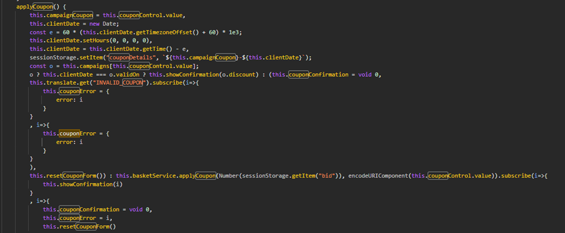
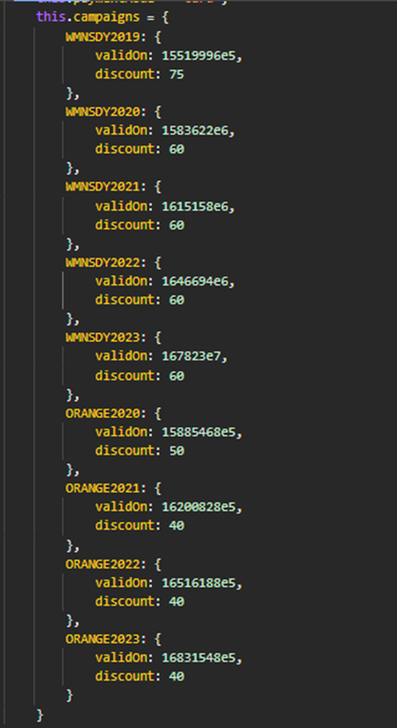
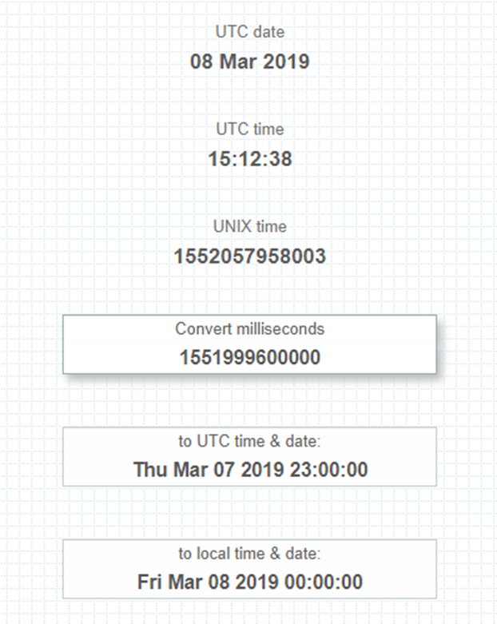

# Juice-Shop Write-up: Expired Coupon

## Challenge Overview

**Title:** Expired Coupon  
**Category:** Improper Input Validation  
**Difficulty:** ⭐⭐⭐⭐ (4/6)

This challenge required successfully applying an expired coupon code by manipulating client-side parameters to bypass time validation.

## Tools Used

- **Browser Developer Tools**: For inspecting network requests and JavaScript code.
- **Text Editor**: For writing and analyzing JavaScript code.

## Methodology and Solution

### Step 1: Identifying the Mechanism for Coupon Application

1. **Code Inspection**:
   - Initially, searching "coupon" into the JavaScript code of main.js revealed the function responsible for applying coupons. This function checks the coupon's validity against a client-side timestamp and a hardcoded list of valid campaigns.

   

### Step 2: Understanding Coupon Validity

2. **Coupon Details Analysis**:
   - The function fetched the coupon code from the user input and verified it against a list of campaign codes stored within the application. Each campaign had an associated timestamp (`validOn`) and discount percentage.

### Step 3: Extracting Campaign Data

3. **Extracting Campaign Information**:
   - Found the list of campaigns by using CTRL+F in the JavaScript code, with their respective expiration timestamps and discounts.

   

### Step 4: Bypassing Time Validation

4. **Manipulating System Time**:
   - We can select a valid coupon randomly from the list that we get, and then, we use an online converter to convert the value of the timestamp, which is in miliseconds, in a valid date :

   

   - Adjusted the computer's system time to match the timestamp of a chosen expired coupon (for instance, `WMNSDY2019`) that originally expired on a specific date converted from its `validOn` timestamp.

### Step 5: Applying the Coupon

5. **Coupon Application**:
   - The system accepted the coupon as valid because the client-side JavaScript used the manipulated system time to validate the coupon's expiration.

## Solution Explanation

The key to solving this challenge was understanding that the coupon application mechanism was vulnerable to client-side time manipulation. By adjusting the system's clock to a date valid for the coupon, it bypassed the expiry check implemented in JavaScript, which only validated the coupon against the client's current date and time.

### Security Recommendations

- **Server-side Validation**: Always validate coupon codes server-side against the expiration date to prevent client-side tampering.
- **Secure Campaign Storage**: Do not store sensitive campaign details, such as expiration times and discount rates, directly within client-accessible scripts.
- **Robust Time Synchronization**: Ensure that critical time-dependent operations are validated against a reliable server-side timestamp.
