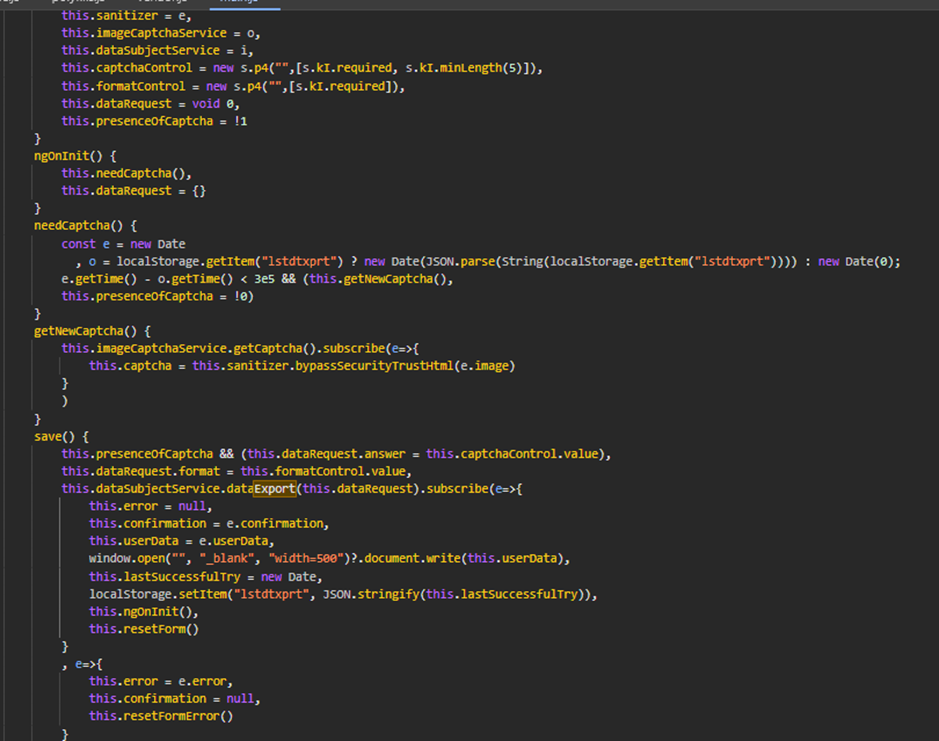
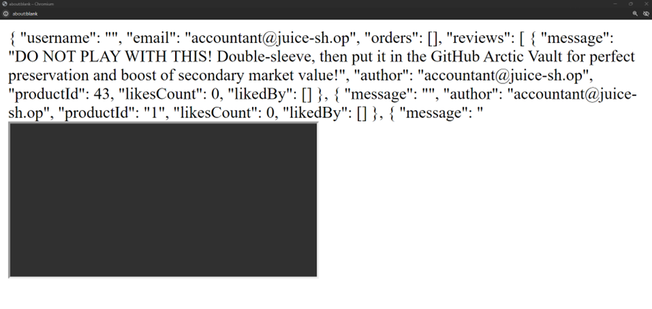
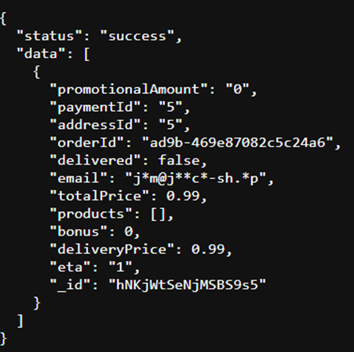
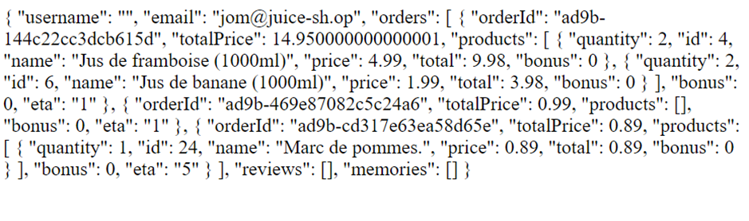

# Juice-Shop Write-up: GDPR Data Theft Challenge

## Challenge Overview

**Title:** GDPR Data Theft\
**Category:** Sensitive Data Exposure\
**Difficulty:** ⭐⭐⭐⭐ (4/6)

This challenge requires exploiting a feature without using SQL injection or other common injection techniques to steal personal data in compliance with GDPR constraints.

## Tools Used

- Web browser
- Developer tools for inspecting JavaScript and network requests

## Methodology and Solution

### Understanding the Functionality

The web application has a feature that allows users to export their data. The process checks the last export time and if the attempt is made within five minutes of the last, it triggers a captcha. The application tracks this using a cookie or a session storage entry. To understand this workflow, I had analyzed the code in main.js :

### Steps Taken to Solve the Challenge

1. **Review Application Behavior**: 
   - Analyzed in how the application handles data exports and how it uses cookies to store the last export time.
   - Noted that the server side strictly validates the time elapsed since the last export before allowing another.

2. **Initial Attempts**:
   - Tried changing the client-side time to bypass the time check, which failed due to server-side validation.
   - Considered using XSS to bypass or manipulate session storage but recalled the challenge hint against using injections.

   

3. **Exploring User Identification**:
   - Noticed from others challenges that the application obfuscates email addresses in certain requests by replacing parts of the email with asterisks, likely as a privacy measure.
   - Speculated that the application might use a simplistic method to match these obfuscated emails to user accounts.
   - For example, when creating an order on Juice Shop : 
   
   

4. **Exploiting Email Obfuscation**:
   - Created a new account with an email address that, when obfuscated, would closely resemble the pattern of another user's obfuscated email.
   - This was done based on the observed pattern from a previous order or interaction within the application where only parts of the email were visible, and asterisks replaced the rest.

5. **Testing Access**:
   - Asked for my data under the newly created email.
   - Successfully accessed data that should have been restricted to the original user, indicating that the application matches users based on the obfuscated pattern rather than the full, actual email.

   

### Solution Explanation

This challenge was resolved by taking advantage of the flawed logic used to identify users based on partially obfuscated email addresses. By crafting an email that matched the obfuscated version, it was possible to access data intended for another user, thereby circumventing the intended data protection mechanisms without direct injection attacks.

## Remediation

To prevent such vulnerabilities in real applications:
- **Enhance Email Handling**: Ensure that internal mechanisms use complete and accurate identifiers rather than relying on partially visible or obfuscated data for critical operations.
- **Secure Data Access Controls**: Implement robust access control checks that do not rely solely on user-provided data, especially data that could be easily mimicked or spoofed.
- **Regular Security Audits**: Conduct thorough security audits and penetration testing to uncover and mitigate logic flaws that could lead to data exposure.

