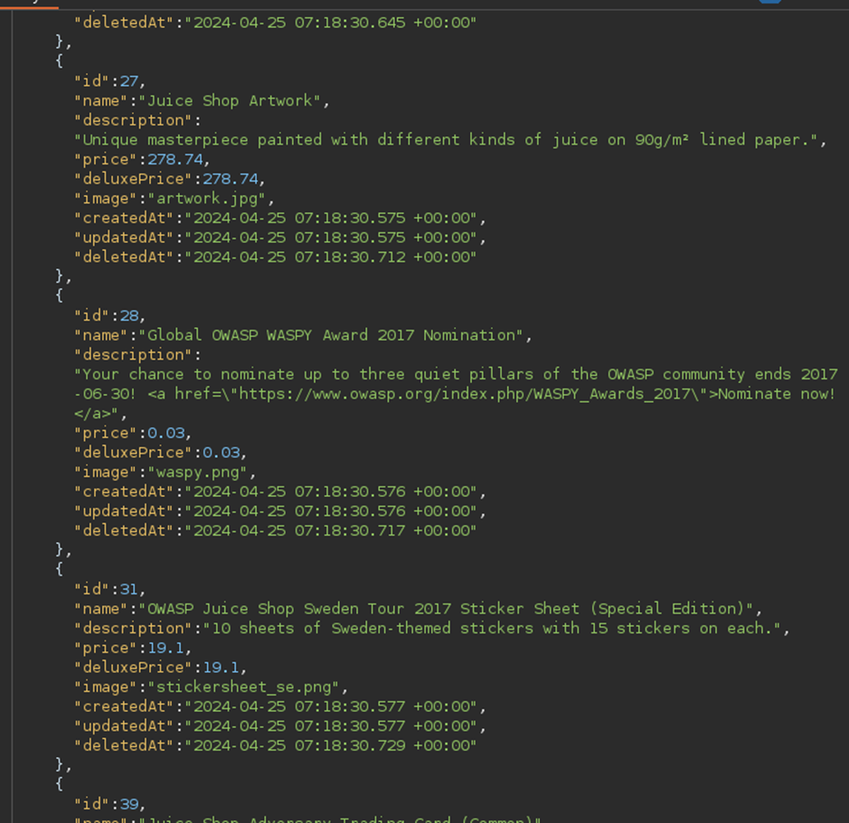
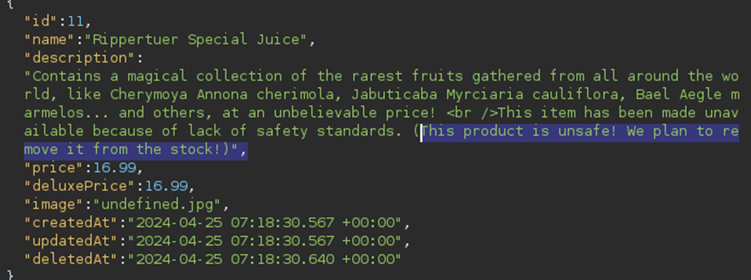
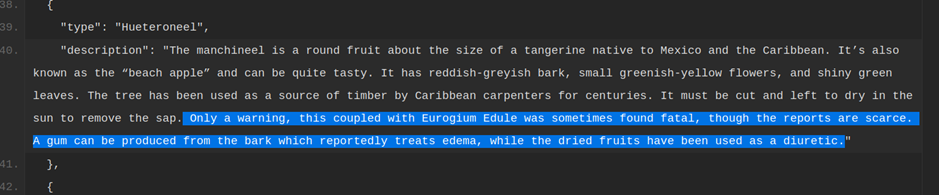
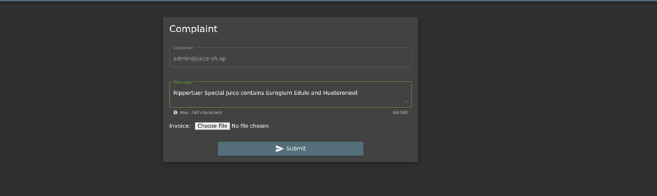

# Juice-Shop Write-up: Leaked Unsafe Product

## Challenge Overview

**Title:** Leaked Unsafe Product  
**Category:** Injection  
**Difficulty:** ⭐⭐⭐⭐ (4/6)

This challenge involved finding information about a potentially hazardous product that had been marked as deleted within the Juice Shop's product database.

## Tools Used

- **Web Browser**: To navigate the Juice Shop and interact with its API.
- **Developer Tools**: To analyze and modify network requests.

## Methodology and Solution

### Step 1: Identifying the Injection Point

1. **Product Search API**:
   - The injection point was located at `127.0.0.1:3000/rest/products/search?q=payload`, which returns products based on the search query parameter. We already use this trick in user credentials challenge.

### Step 2: Crafting the SQL Injection Query

2. **SQL Injection to Uncover Hidden Products**:
   - Utilized the query `test')) UNION SELECT * FROM PRODUCTS WHERE deletedAt IS NOT NULL--` to fetch products that were hidden from the standard listings, assumed to have been removed due to safety concerns or other reasons.

   

### Step 3: Analyzing the Output

3. **Reviewing Deleted Products**:
   - Among the retrieved products, the "Rippertuer Special Juice" was identified based on its unique description and suspect ingredients listed.

   

### Step 4: Investigating Unsafe Ingredients

4. **Ingredient Analysis**:
   - Investigated the potential dangers of each ingredient using external sources but I didn't find something interesting.
   - I searched on Google the name of the beverage and I find a Pastebin link which detailed the composition of the "Rippertuer Special Juice".
   - Inside the composition I find this line : 

   

### Step 5: Reporting the Hazardous Ingredient

5. **Finding the Problematic Ingredient**:
   - Discovered that the juice contained Hueteroneel (Manchineel fruit), which is extremely toxic and unsafe for consumption, especially when combined with Eurogium Edule. So I reported it to complain section : 
    
   

## Solution Explanation

The resolution involved a combination of SQL injection and external research. By accessing hidden product data through a crafted SQL query, and then validating ingredient safety via online research, it was determined that the product contained a dangerous combination of ingredients. The discovery was reported through the Juice Shop's complaint system, leading to the successful completion of the challenge.

### Security Recommendations

To prevent similar vulnerabilities:
- **Implementing Proper Input Sanitization**: This would protect against SQL Injection.
- **Ensuring Comprehensive Product Review Processes**: Especially for products intended for consumption, rigorous checks should be in place.
- **Use of Secure and Transparent Ingredient Disclosure**: To maintain consumer trust and comply with safety regulations.

This challenge highlighted the importance of backend security measures to protect against unauthorized data retrieval and emphasized the need for accurate and safe product listings.