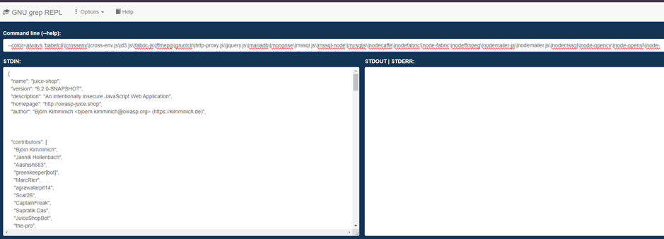
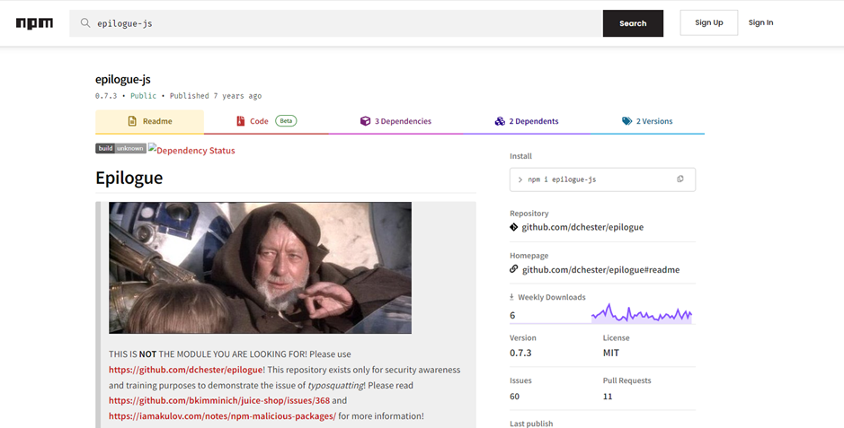

# Juice-Shop Write-up: Legacy Typosquatting

## Challenge Overview

**Title:** Legacy Typosquatting  
**Category:** Cryptographic Issues  
**Difficulty:** ⭐⭐⭐⭐ (4/6)

This challenge requires identifying a typosquatted library used by Juice Shop, a form of cyber threat where attackers exploit common typographical errors to push malicious or deceptive packages.

## Tools Used

- **GNU grep**: For searching through files and directories.
- **Web Browser**: For accessing package repositories and reading documentation.

## Methodology and Solution

### Step 1: Review Hint and Background Information

The challenge hint suggests reading about npm malicious packages, focusing on typosquatting issues. Typosquatting involves packages named similarly to popular libraries, intended to trick developers into installing malicious versions.

### Step 2: Inspecting Developer's Backup

An examination of the developers' backup file (`package.json.bak`) reveals a list of dependencies used by Juice Shop. This file is crucial for identifying potential typosquatted packages by comparing the listed package names with their legitimate counterparts. I tried to obtain a quick win by comparing all library with most common typosquatted library but I don't obtained any result using this method :

### Step 3: Investigate Packages on npm

Each package from the backup file is checked on the npm repository. The search is to ensure that each package is legitimate, not a typosquatted version.

### Step 4: Identifying the Typosquatted Package

Upon detailed scrutiny, the package `epilogue-js` on npm raises suspicion. The real and widely-used package should be `epilogue`. The `epilogue-js` package on npm is flagged with a warning:
- It directs users to use another repository and highlights its existence solely for security awareness and training, indicating it's a demonstration of typosquatting.

### Solution Explanation

The package `epilogue-js` was identified as a typosquatted version of the legitimate `epilogue` package. Installation of such a package could lead to potential security vulnerabilities within an application. The challenge was resolved by searching package names on npm.

### Security Recommendations

- **Regular Audits**: Perform regular audits of all third-party packages used in projects to ensure they are from trusted sources.
- **Use of Verified Sources**: Only use packages from verified sources and maintain a list of approved packages for development use.
