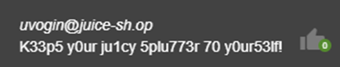
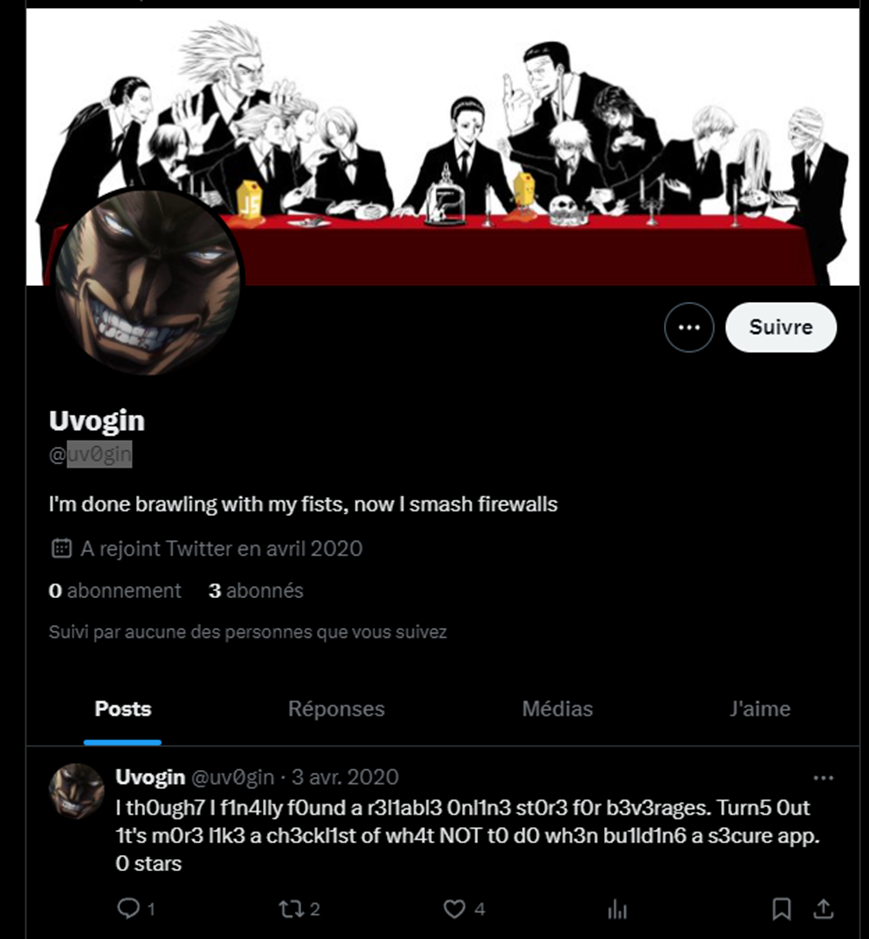
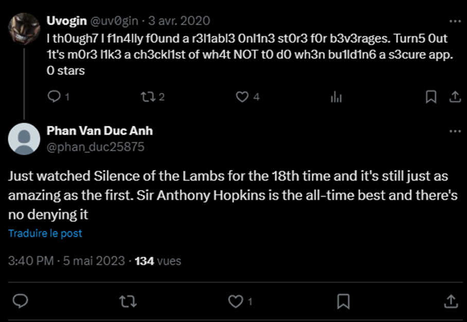
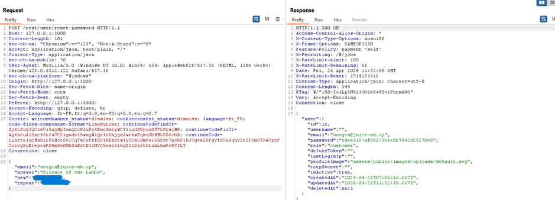

# Juice-Shop Write-up: Login Uvogins

## Challenge Overview

**Title:** Login Uvogins  
**Category:** Broken Authentication  
**Difficulty:** ⭐⭐⭐⭐ (4/6)

This challenge involves logging into the account of Uvogin at Juice Shop using information derived from public sources and his security question.

## Tools Used

- **Web Browser**: For accessing the Juice Shop and social media platforms.
- **Social Media Platforms**: Particularly Twitter, to gather clues about Uvogin's personal preferences and potential security question answers.

## Methodology and Solution

### Step 1: Identify Uvogin's Email and Security Question

- **Email:** uvogin@juice-sh.op
- **Security Question:** "What is your favorite movie?"

### Step 2: Analyzing Uvogin's Writing Style

1. **Leet Speak Analysis**:
   - Uvogin's comments are consistently written in Leet Speak, substituting letters with numbers and special characters.

   

   

   

   - Comments like "0 stars for this horrible security" showcase his frustration and hint at his distinct style of communication.

### Step 3: Utilizing OSINT

2. **Online Search**:
   - Following the hint about alias reuse and unique writing habits, an online search for `Uv0g1n` was conducted, focusing on platforms like Twitter.

   

3. **Finding Relevant Accounts**:
   - A Twitter profile matching the username `Uv0gin` was found, which appeared to be a fan account referencing the anime "Hunter x Hunter", but this was not the correct answer.
   - This response to a tweet of Uv0gin provided a key clue in a tweet praising the movie "Silence of the Lambs" :

   

### Step 4: Testing the Security Question Answer

4. **Resetting the Password**:
   - Using the answer "Silence of the Lambs" derived from the tweet, the password reset function on Juice Shop was successfully used to reset Uvogin's password.

   

5. **Logging into the Account**:
   - After resetting the password, access to Uvogin's account was gained using the new credentials.

## Solution Explanation

This challenge was resolved by connecting Uvogin's unique Leet Speak style to his social media activity, identifying his favorite movie through a Twitter post, and using that information to answer his security question on Juice Shop. This method highlights the importance of careful personal information management on public platforms, as seemingly innocuous details can compromise security.

### Security Recommendations

- **Stronger Security Questions**: Use more complex and less predictable security questions.
- **Awareness of Online Presence**: Educate users about the risks associated with sharing too much personal information online.
- **Don't use Security Questions**: Best security practice is to not use security questions for ressettings password, but rather send an email to user to confirm that he want to change his password.

