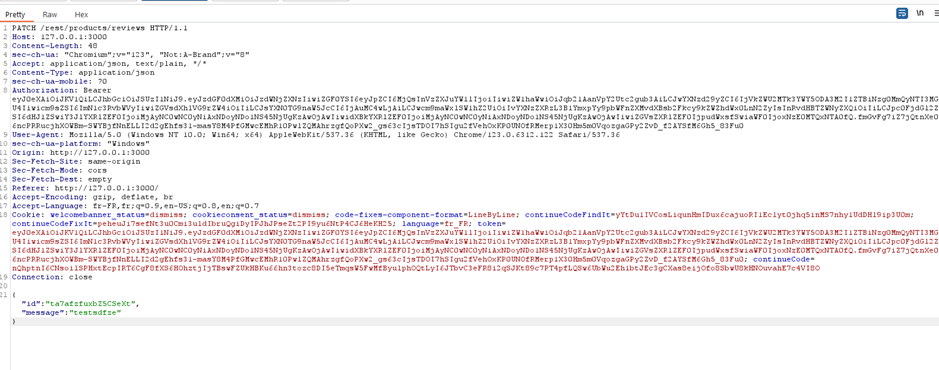

# Juice-Shop Write-up: NoSQL Manipulation

## Challenge Overview

**Title:** NoSQL Manipulation  
**Category:** Injection  
**Difficulty:** ⭐⭐⭐⭐ (4/6)

This challenge involves exploiting a NoSQL injection vulnerability to update multiple product reviews simultaneously in a NoSQL database.

## Tools Used

- **Interception Proxy (e.g., Burp Suite):** To capture and modify the HTTP requests.
- **Knowledge of NoSQL Injection Techniques:** Understanding of MongoDB query operators.

## Methodology and Solution

### Step 1: Analyzing the Normal Update Request

Initially, I captured a normal HTTP PATCH request by using Burp Suite. This request meant for updating a single product review. The request looked something like this:

```http
PATCH /rest/products/reviews HTTP/1.1
Host: 127.0.0.1:3000
Content-Type: application/json

{
  "id": "specific_review_id",
  "message": "updated_review_text"
}
```

In Burp suite, looks like this :




### Step 2: Crafting the NoSQL Injection Payload

To exploit the NoSQL injection, the challenge was to update multiple reviews at once. This required manipulating the `id` parameter in the JSON payload. MongoDB, the underlying NoSQL database, interprets certain patterns in a specific way. For this task, I used the `$ne` (not equal) operator, which is a MongoDB operator to select the documents where the value of the field is not equal to the specified value. Using `{"$ne": null}` ensures that the condition is true for all entries (as none of the `id`s are `null`).

### Step 3: Sending the Modified Request

I modified the request to include the injection in the `id` field:

```http
PATCH /rest/products/reviews HTTP/1.1
Host: 127.0.0.1:3000
Content-Type: application/json

{
  "id": {"$ne": null},
  "message": "updated_review_text"
}
```

Upon sending this request, the server processed it as a valid query, updating all reviews to have the same `message` due to the condition applied through NoSQL injection.

### Solution Explanation

The challenge was completed successfully by manipulating the product review update functionality using a NoSQL injection. The payload `{"$ne": null}` effectively bypassed the intended functionality of updating only specified entries, leading to an unauthorized bulk update of all entries in the database.

This kind of vulnerability arises from improper handling of user inputs in the application's backend, specifically when inputs are directly used in database queries without proper sanitation or parameterization, which is a common issue in applications using NoSQL databases like MongoDB.

### Security Recommendations

- **Input Validation and Sanitization:** Ensure all inputs are validated and sanitized on the server side before being processed.
- **Use of Parameterized Queries:** Always use parameterized queries or the equivalent provided by database management libraries to handle data input, especially in a NoSQL environment.
