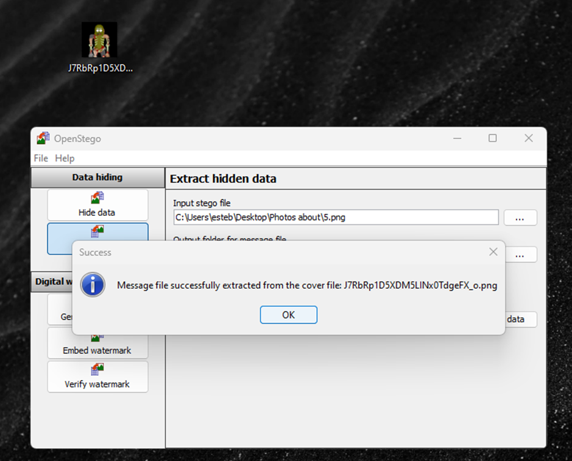

# Juice-Shop Write-up: Steganography Challenge

## Challenge Overview

**Title:** Steganography\
**Category:** Security through Obscurity\
**Difficulty:** ⭐⭐⭐⭐ (4/6)

This challenge tests ability to uncover hidden data within files, specifically images. The task was to discover a notable character hidden within an image on the website, utilizing various steganography detection tools.

## Tools Used

- Web browser
- OpenStego
- Aperisolve
- Google Lens (or any other image recognition tool)

## Methodology and Solution

The process to solve the Steganography challenge involved multiple steps focusing on analysis and extraction:

1. **Identify Potential Sources**: Based on the hint provided in the challenge description, focused on the images from the 'About' page (`http://127.0.0.1:3000/#/about`) where a gallery of images was located.

2. **Download Images**:
   - Accessed the photo wall and downloaded all images available at `127.0.0.1:3000/assets/public/images/carousel/[n]` where `n` ranged from 1 to 7.
   - Noted that only the fifth image was in PNG format, which often supports higher quality and more complex steganography techniques compared to JPG.

3. **Initial Analysis with Aperisolve**:
   - Used Aperisolve, a web-based tool for analyzing and uncovering hidden data within images. Checked each image for common steganography signs such as LSB (Least Significant Bit) changes or hidden ZIP files.
   - Found no significant hidden data with this approach.

4. **Deeper Analysis with OpenStego**:
   - Employed OpenStego specifically on the PNG image to check for embedded data. OpenStego is known for its effectiveness with PNG files due to their lossless nature.
   - Successfully extracted hidden data from the fifth image.

   

5. **Identify the Character**:
   - Used Google Lens to identify the extracted image, which was found to be Pickle Rick from the animated show "Rick and Morty".

6. **Submit the Character for Challenge Completion**:
   - Entered the character name "Pickle Rick" in the required field on the website to complete the challenge.

## Solution Explanation

This challenge utilized steganography to hide information within an image file. The correct approach required not only the right tools but also selecting the appropriate image format for analysis. OpenStego was crucial for extracting the hidden data due to its robust handling of PNG files, which can contain more complex forms of hidden data compared to other image formats.

## Remediation

While this challenge was designed for educational purposes, it highlights important considerations in real-world scenarios:
- **Monitoring and Filtering**: Implement monitoring to detect unusual uploads or access to sensitive areas, and filter out potentially harmful content.
- **Education and Policies**: Establish clear policies regarding data handling and educate staff about data security risks, including steganography.

