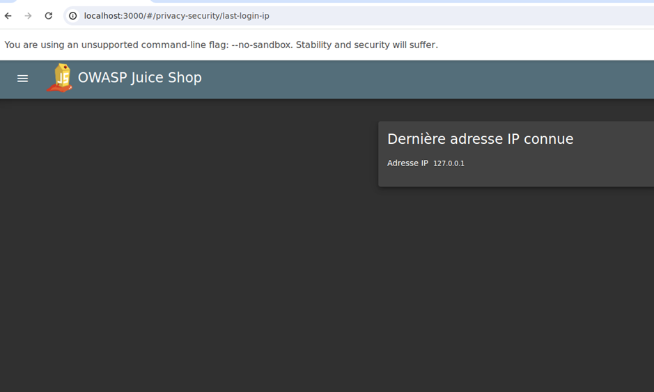
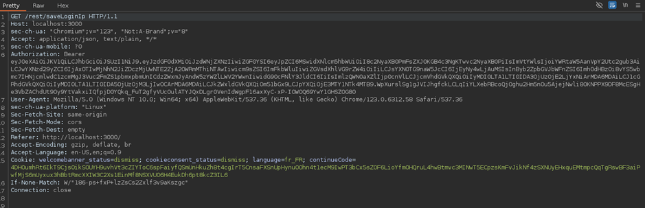
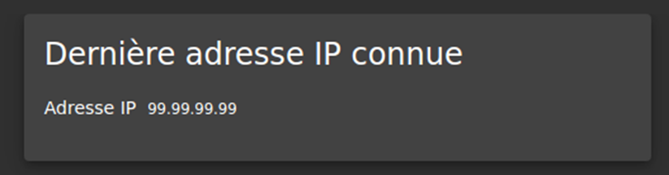
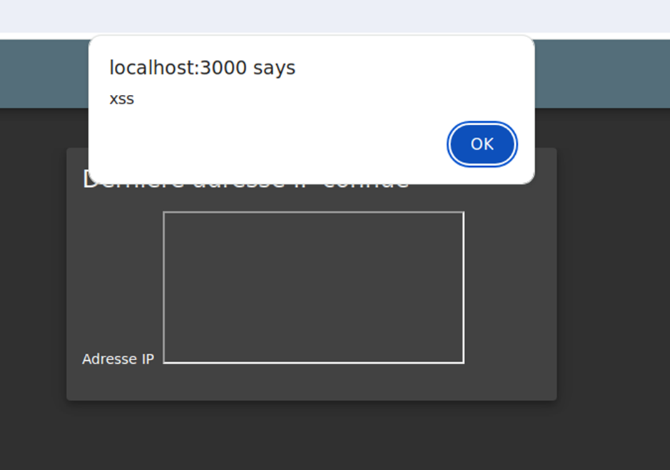

# Juice-Shop Write-up: HTTP-Header XSS

## Challenge Overview
**Title:** HTTP-Header XSS  
**Category:** Cross-Site Scripting (XSS)  
**Difficulty:** ⭐⭐⭐⭐ (4/6)  

The objective of this challenge is to perform a persisted XSS attack using `<iframe src="javascript:alert('xss')">` via an HTTP header.

## Tools Used
- **Web Browser:** For navigating the Juice Shop application and accessing developer tools.
- **Burp Suite:** For intercepting and modifying HTTP requests to inject the XSS payload.

## Methodology and Solution

### Step 1: Identifying the Target Endpoint
The challenge involves injecting an XSS payload through an HTTP header. We hypothesized that the IP address logging functionality in the admin panel might be a potential target because it's one of the only information that we can input using an header and that is clearly reflected somewhere. This functionality logs the IP address of users and displays it in the admin interface :




1. **Navigate to Admin Panel:** Go to `http://localhost:3000/#/privacy-security/last-login-ip`.

### Step 2: Intercepting the Request
1. **Log Out:** Perform a logout action and intercept the request using Burp Suite to analyze the headers sent to the server.




### Step 3: Finding the Relevant Header
By inspecting the intercepted request, we identified that the `True-Client-IP` header could be manipulated to reflect arbitrary values:
```http
POST /rest/user/logout HTTP/1.1
Host: localhost:3000
...
True-Client-IP: 99.99.99.99
...
```

Here is the state of last IP page after this request, confirming injection possibility: 



### Step 4: Testing IP Reflection
1. **Modify the Header:** Add a standard IP address in the `True-Client-IP` header to see if it is reflected in the admin panel.
2. **Verify Reflection:** Confirm that the IP address appears in the admin panel as expected.

### Step 5: Crafting the XSS Payload
To exploit this vulnerability, we need to craft an XSS payload that will be reflected in the admin panel:
- **Payload:**
  ```http
  True-Client-IP: <iframe src="javascript:alert('xss')">
  ```

### Step 6: Injecting the Payload
1. **Modify Header in Burp Suite:** Replace the `True-Client-IP` value with the XSS payload  : `<iframe src="javascript:alert('xss')"`>.
2. **Send Request:** Log out and send the modified request through Burp Suite.

### Step 7: Verifying the XSS Execution
1. **Log In as Admin:** Log back in to access the IP panel.
2. **Observe XSS Execution:** Check the interface for the execution of the XSS payload. If successful, an alert box with the message `xss` should appear.



## Solution Explanation
The challenge was solved by identifying a reflected XSS vulnerability in the `True-Client-IP` header. By injecting a payload that gets reflected in the admin panel, we successfully executed a persisted XSS attack.

## Remediation
- **Input Validation and Sanitization:** Ensure all user inputs, including HTTP headers, are properly validated and sanitized to prevent injection attacks.
- **Escape Output:** Always escape user inputs when displaying them in the user interface to prevent XSS.

