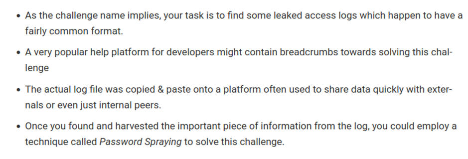
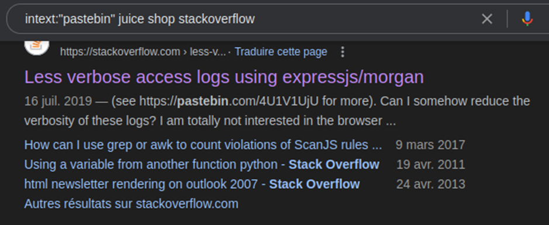
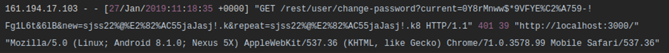
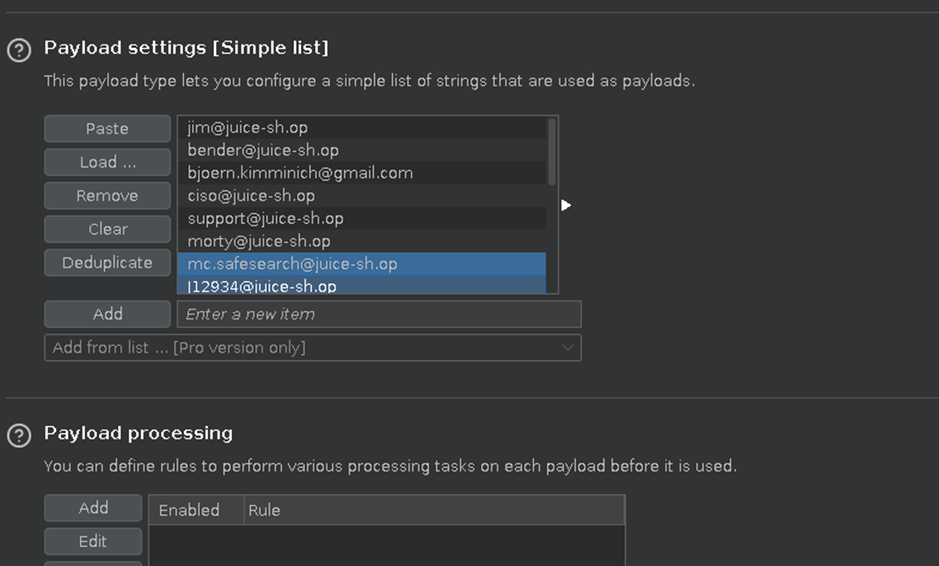

# Juice-Shop Write-up: Leaked Access Log

## Challenge Overview

**Title:** Leaked Access Log  
**Category:** Sensitive Data Exposure  
**Difficulty:** ⭐⭐⭐⭐⭐ (5/6)

This challenge revolves around locating a leaked access log that contains sensitive user information, potentially exposing login credentials.

## Tools Used

- **Google Search:** Utilized for advanced searching (using Google Dorks).
- **Stack Overflow and Pastebin:** Identified as platforms where developers might inadvertently share sensitive information.

## Methodology and Solution

### Step 1: Initial Clue Gathering

Based on the challenge hint, we suspected that a developer might have posted sensitive logs on a public platform like Stack Overflow or Pastebin :




### Step 2: Google Dorking

Performed a Google Dork search with the following query:
```
intext:"pastebin" juice shop stackoverflow
```
This query aimed to find any Stack Overflow posts that referenced Pastebin links containing Juice Shop logs :


### Step 3: Analyzing the Stack Overflow Post

Located a relevant Stack Overflow discussion where a developer asked about reducing the verbosity of Express.js/Morgan logs, referring to a Pastebin link:




### Step 4: Examining the Pastebin Content

Accessed the provided Pastebin link from the Stack Overflow post, which contained a series of access logs. Among the logs, there was an entry detailing a password change attempt by a user, showcasing a discrepancy in the confirmation password field, hinting at potential reuse of the old password.



### Step 5: Decoding and Testing the Password

Identified the password from the logs:
```
0Y8rMnww$*9VFYE%C2%A759-!Fg1L6t&6lB
```
Decoded the URL-encoded characters and prepared the password for testing:
```
0Y8rMnww$*9VFYE§59-!Fg1L6t&6lB
```

### Step 6: Brute Force Testing

1. Using the user emails collected from a previous administrative panel challenge...



2. ... I set up a brute-force test to match the decoded password against known user accounts.


### Step 7: Successful Login Attempt

Successfully logged into the Juice Shop application using the email:
```
J12934@juice-sh.op
```
And the password derived from the access log. This confirmed that the leaked credentials were still valid and associated with this user account.

## Solution Explanation

This challenge was solved by piecing together information from various online platforms and applying deductive reasoning to identify and use leaked credentials. The successful exploitation of these credentials underscores the importance of securing log outputs and monitoring where and how sensitive information is shared in development environments.

## Recommendations

- **Log Management:** Ensure that logging mechanisms do not inadvertently capture and display sensitive information, especially in production environments.
- **Developer Training:** Educate developers on the risks associated with sharing potentially sensitive information on public forums.
