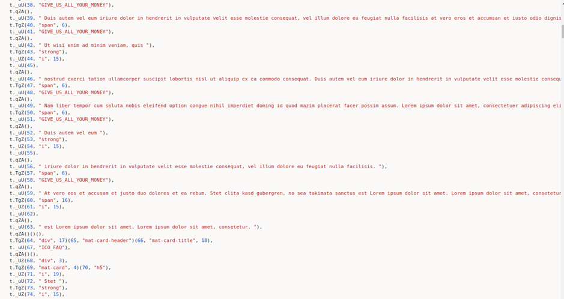
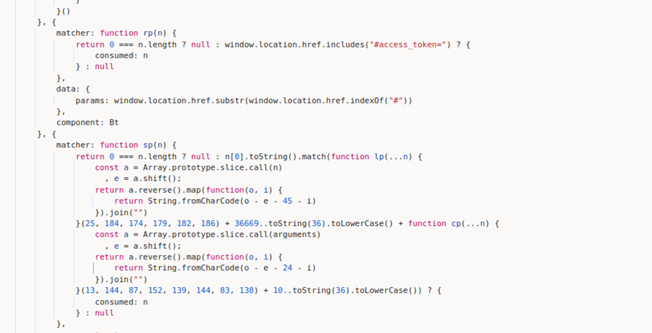

# Juice-Shop Write-up: Blockchain Hype

## Challenge Overview

**Title:** Blockchain Hype  
**Category:** Security through Obscurity  
**Difficulty:** ⭐⭐⭐⭐⭐ (5/6)

This challenge involves uncovering hidden paths related to a secretive initial coin offering (ICO) for the fictional 'JuicyCoin' within the Juice Shop application.

## Tools Used

- **Web Browser:** Main tool for accessing the Juice Shop application and interacting with its JavaScript files.
- **Text Editor:** For analyzing and searching through the `main.js` file to uncover obscured paths.

## Methodology and Solution

### Step 1: Analyzing `main.js`

Began by examining the `main.js` file, searching for any references that might pertain to an ICO or token sale. Used keywords like "token", "ICO", "sale", and "juicycoin" to filter through the contents.

I found the section related to the content of the page, but not the path himself :

### Step 2: Identifying Key Sections

So, I go back to the section where all paths are defined. Following the hints of the challenges, I identified sections within `main.js` that included unusual obfuscation patterns or encrypted strings, suggesting possible links to hidden features or pathways. It's the only moment in paths definition where a path seems to no be in clear text, so I think that there is high chance to find something behind this obfuscation.

### Step 3: De-obfuscation

Attempted to manually decode obfuscated JavaScript code snippets to reveal meaningful paths or URLs. Initially, the obfuscation seemed resistant to straightforward decoding methods.

### Step 4: AI Assistance

Utilized AI-powered tool (GPT 4) to assist in de-obfuscating the strings. This was necessary due to the complexity of the obfuscation, which might involve multiple encoding layers or a custom obfuscation technique. There is potentially other way to resolve this challenge, but when code are obfuscated, I think AI are the best way to de-obfuscating things.

### Step 5: Discovering the Hidden Path

Through the combination of manual efforts and AI-assisted decoding, discovered the path `tokensale-ico-ea`, leading to the speculation that this could be the secretive path for the ICO.

### Step 6: Verification

Navigated to `http://127.0.0.1:3000/juicycoin#/tokensale-ico-ea` in the browser. This path led to a hidden part of the application discussing the pre-launch details of the 'JuicyCoin' ICO, confirming the successful completion of the challenge.

## Solution Explanation

The solution to this challenge required a detailed analysis of the application's frontend JavaScript file, particularly focusing on sections that contained obfuscated or encrypted data. By using AI to assist in the de-obfuscation, the hidden ICO-related path was successfully uncovered and accessed.

## Remediation

- **Code Transparency:** Avoid storing path in clear in the client code.
- **Secure by Authentificatin:** Ensure that all sensitive or hidden features are protected by proper authentication and authorization mechanisms, not just by obscurity.
