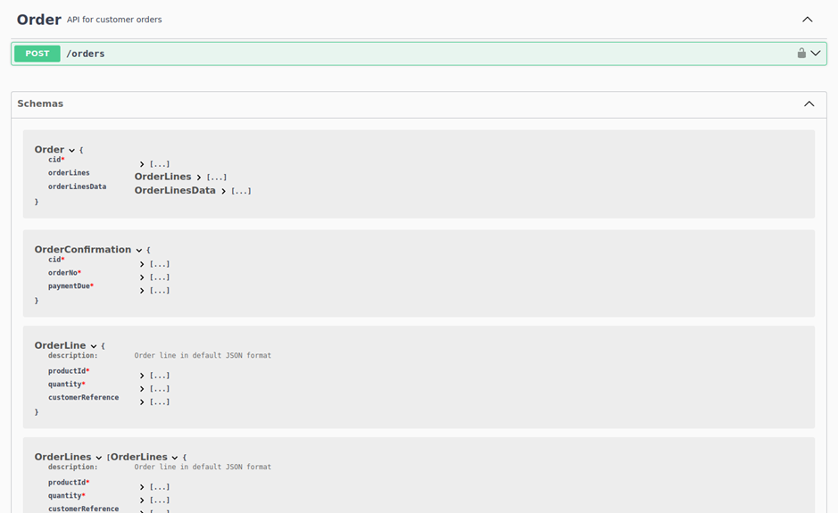
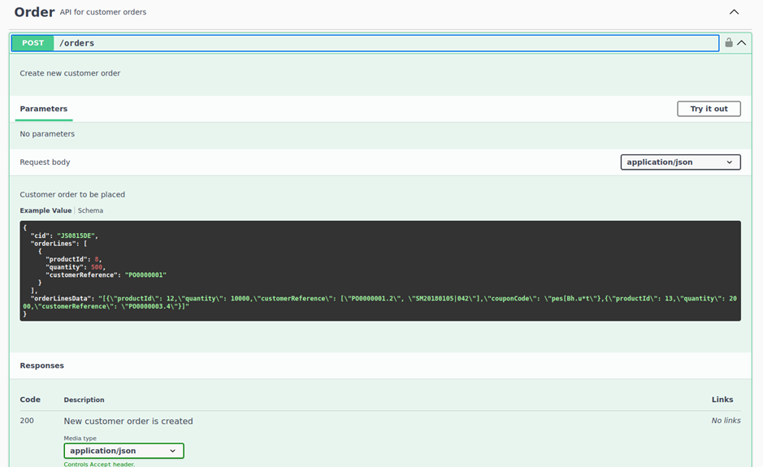
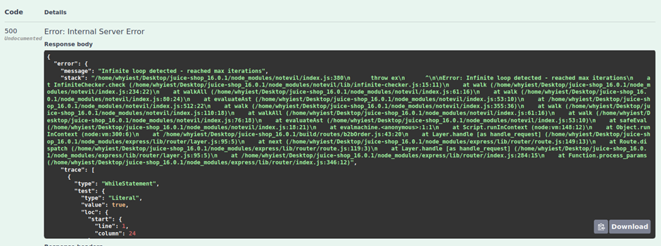

# Juice-Shop Write-up: Blocked RCE DoS

## Challenge Overview
**Title:** Blocked RCE DoS  
**Category:** Insecure Deserialization  
**Difficulty:** ⭐⭐⭐⭐⭐ (5/6)  

The objective of this challenge is to perform a remote code execution (RCE) that keeps the application busy indefinitely, triggering the server's protection against a specific DoS attack vector.

## Tools Used
- **Web Browser:** For navigating the Juice Shop application and accessing developer tools.
- **GoBuster:** For directory and file brute-forcing to discover hidden paths.
- **Swagger UI:** For interacting with the Juice Shop API and testing payloads.
- **Burp Suite:** For intercepting and modifying HTTP requests to test for injection points.

## Methodology and Solution

### Step 1: Discovering the API Documentation
Using GoBuster, we discovered the Swagger API documentation for Juice Shop at `http://localhost:3000/api-docs`.




### Step 2: Identifying the Vulnerable Endpoint
Within the Swagger UI, we identified the `/orders` endpoint, which allows adding new orders. This endpoint accepts JSON data, including an attribute called `orderLinesData` that can contain arbitrary JSON strings.

### Step 3: Authorizing API Requests
To make example API requests (useful for next step)., we needed to include a bearer token for authorization:
1. **Retrieve Bearer Token:** Extract the token from the browser's developer tools.
2. **Authorize Request:** Input the token in the Swagger UI to authorize examples requests 


### Step 4: Testing the API Endpoint
1. **Try It Out:** Click "Try it out" in the Swagger UI for the `/orders` endpoint and observe the example payload structure:
   ```json
   {
     "cid": "JS0815DE",
     "orderLines": [
       {
         "productId": 8,
         "quantity": 500,
         "customerReference": "PO0000001"
       }
     ],
     "orderLinesData": "[{\"productId\": 12,\"quantity\": 10000,\"customerReference\": [\"PO0000001.2\", \"SM20180105|042\"],\"couponCode\": \"pes[Bh.u*t\"},{\"productId\": 13,\"quantity\": 2000,\"customerReference\": \"PO0000003.4\"}]"
   }
   ```

We can see the example page here :



### Step 5: Crafting the DoS Payload
To exploit the vulnerability, we crafted a payload designed to cause an infinite loop on the server:
- **Payload:**
  ```json
  {
    "orderLinesData": "(function dos() { while(true); })()"
  }
  ```

### Step 6: Injecting the Payload
1. **Replace Payload:** Modify the example payload in the Swagger UI to include our DoS payload.
2. **Send Request:** Execute the request by clicking "Execute".

### Step 7: Observing the Results
After injecting the payload, the server became unresponsive for about 2 seconds before recoverin and displaying an internal server error message. This indicates that the server detected and mitigated the DoS attack, but it's normal as Juice-Shop limite Dos attack to 2 seconds to avoid crashing our server.



## Solution Explanation
The challenge was solved by identifying an insecure deserialization vulnerability in the `orderLinesData` parameter of the `/orders` endpoint. By injecting a payload that caused an infinite loop, we were able to trigger the server's protection mechanisms against DoS attacks.

## Remediation
- **Input Validation and Sanitization:** Ensure all user inputs are properly validated and sanitized to prevent injection attacks.
- **Use Safe Deserialization Practices:** Implement secure deserialization methods to prevent the execution of arbitrary code.
- **Rate Limiting and Timeouts:** Implement rate limiting and request timeouts to mitigate the impact of potential DoS attacks.

