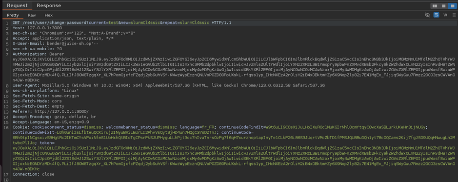
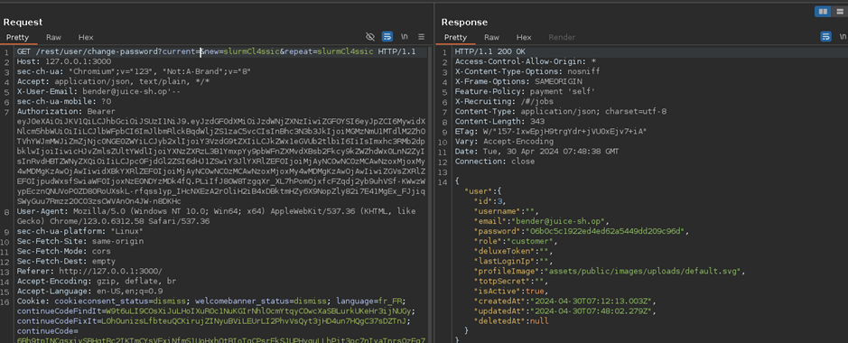

# Juice-Shop Write-up: Change Bender's Password

## Challenge Overview

**Title:** Change Bender's Password\
**Category:** Broken Authentication\
**Difficulty:** ⭐⭐⭐⭐⭐ (5/6)

This challenge involves changing the password of the user Bender to `slurmCl4ssic` on the `juice-sh.op` platform without using SQL Injection or the forgot password functionality.

## Tools Used

- **Web Browser**: For interacting with the web application and changing passwords.
- **HTTP Interception Tool**: Such as Burp Suite, used to intercept, modify, and resend HTTP requests.

## Methodology and Solution

### Initial Setup

1. **Accessing Account**:
   - Log into Bender’s account using provided credentials or by bypassing login mechanisms.

### Exploring Change Password Functionality

2. **Intercepting the Change Password Request**:
   - Use an HTTP interception tool to capture the request made when attempting to change Bender's password.
   - Analyze the request to understand the parameters involved, especially focusing on how the current password is handled.

   

### Manipulating the Request

3. **Request Manipulation Trials**:
   - Attempt to change the password by modifying the `current` password field in various ways to explore potential weaknesses:
     - Try using an incorrect password directly — FAILED

     

     - Leave the `current` password field blank - FAILED

     

     - Remove the `current` password parameter entirely from the request - WORKED

     

### Successful Exploitation

4. **Bypassing Password Check**:
   - Discover that removing the `current` password field entirely from the request bypasses the check for the current password and allows setting a new password.
   - Submit the request with the `current` password parameter removed and the new password set to `slurmCl4ssic`.

## Solution Explanation

The challenge was successfully solved by identifying a vulnerability in the password change functionality where the server does not properly validate the presence of the `current` password parameter. By omitting this parameter, the server processes the request as valid, allowing the password to be changed without knowing the original password.

## Remediation

To prevent such vulnerabilities in real-world applications:

- **Strict Parameter Validation**: Ensure that all necessary parameters are checked for their presence and validity before processing requests.
- **Enhanced Server-Side Logic**: Implement server-side logic to detect and reject incomplete or malformed requests.
