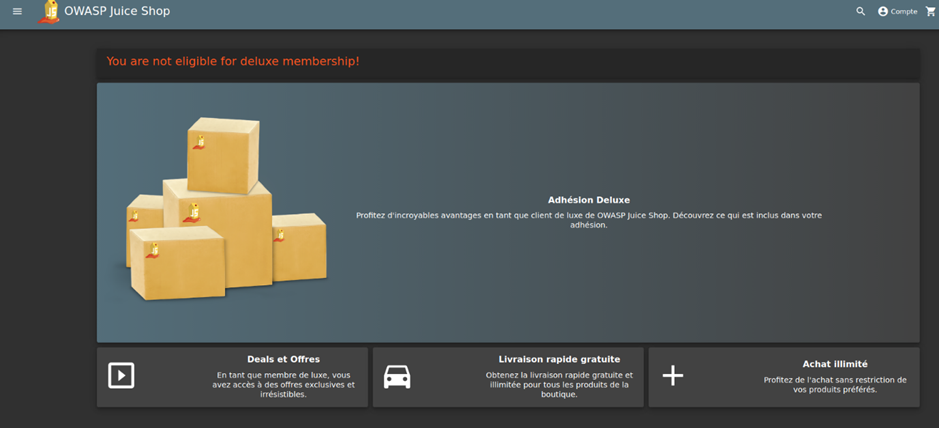
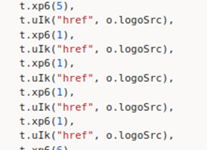
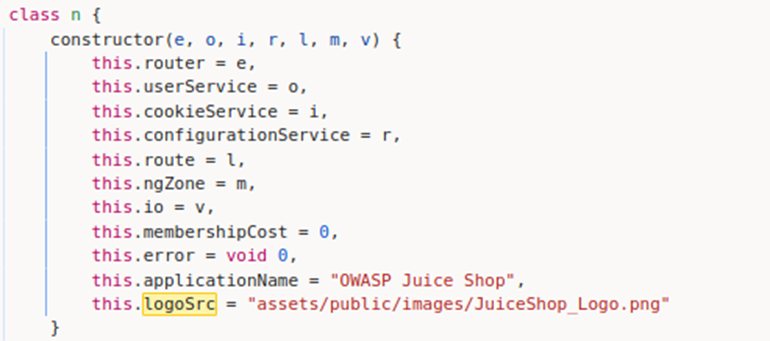
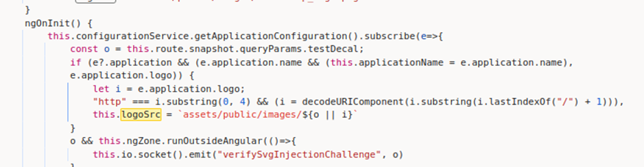
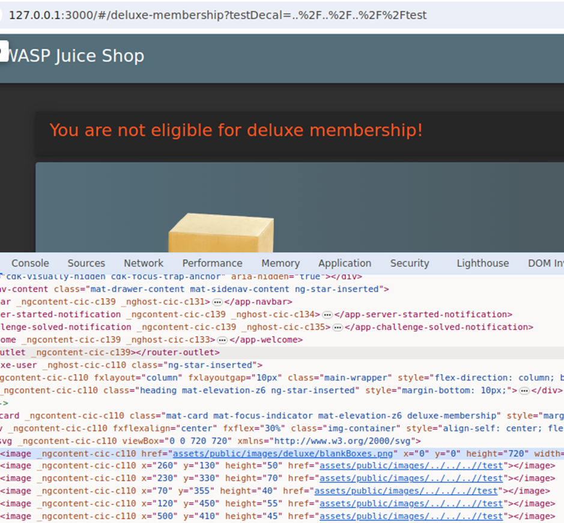

# Juice-Shop Write-up: Cross-Site Imaging

## Challenge Overview

**Title:** Cross-Site Imaging  
**Category:** Cross-Site Request Forgery (CSRF)  
**Difficulty:** ⭐⭐⭐⭐⭐ (5/6)

The objective of this challenge is to manipulate the source URL for images used in the deluxe membership package display on the Juice Shop website to inject an external image.

## Tools Used

- **Web Browser:** For navigating to the Juice Shop application and modifying URLs.
- **Developer Tools:** Used to inspect and manipulate HTML and JavaScript code running in the Juice Shop.

## Methodology and Solution

### Step 1: Analyzing the Page

Accessed the Deluxe Membership page at `http://127.0.0.1:3000/#/deluxe-membership` and observed that it displayed several images of deluxe boxes which are styled with various decals.




### Step 2: Identifying Image Source Manipulation

Inspected the source code of the page to understand how images are loaded and displayed. Discovered that images are dynamically loaded based on the `logoSrc` attribute, which can be manipulated through URL parameters.



We can find the default source in the main.js also : 






### Step 3: Code Review

The JavaScript responsible for this functionality was analyzed:
- Initial `logoSrc` is set to the default image path in the constructor.
- According to my reading of the JS code, if a `testDecal` URL parameter is provided, it overrides the default image path. If not, default path is used.

### Step 4: Exploiting with Redirect

Attempted to exploit this by specifying external images via the `testDecal` parameter : 

Constructed the payload to use a relative path escape sequence combined with a redirection to an external image:
```plaintext
http://127.0.0.1:3000/#/deluxe-membership?testDecal=../../../../redirect?to=https://dummyimage.com/600x400/000/fff&x=https://github.com/bkimminich/juice-shop
```

1. This payload uses directory traversal (`../../../../`) to reach the server root and then utilizes the internal redirect functionality to point to an external dummy image.
2. This payload use `&x=https://github.com/bkimminich/juice-shop` to bypass the allowlist. If you don't undestand this step, refer to the allowlist bypass challenge.

### Step 5: Final Exploit

Submitted the URL with the crafted `testDecal` parameter, effectively displaying an external image, confirming the vulnerability in handling the image source path.




## Solution Explanation

The challenge was solved by exploiting the relative path handling in the image source attribute combined with an internal redirect to an allowed URL, which included an external image URL as a parameter.

## Remediation

- **Validate and Sanitize Input:** Ensure that all parameters affecting file paths or URLs are strictly validated and sanitized to prevent directory traversal and other injection attacks.
- **Restrict URL Redirection:** Implement strict whitelisting for redirect targets to ensure only intended destinations are permissible.
- **Use Absolute Paths:** Modify the application to use absolute paths for internal resources to prevent misuse of relative paths.