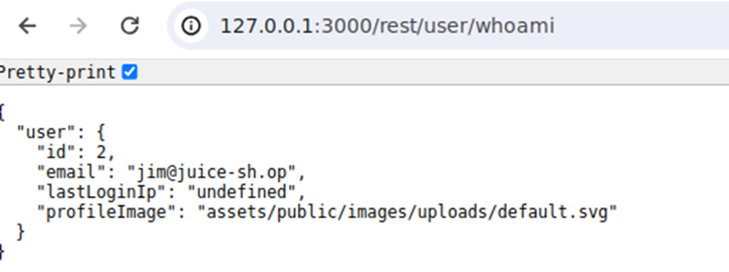
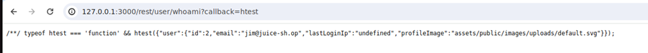

# Juice-Shop Write-up: Email Leak

## Challenge Overview

**Title:** Email Leak  
**Category:** Security Misconfiguration  
**Difficulty:** ⭐⭐⭐⭐⭐ (5/6)

The objective of this challenge is to exploit improper access control in the Juice Shop application to retrieve sensitive user information without proper authorization.

## Tools Used

- **Web Browser:** Used to interact with the application and observe HTTP requests.
- **Network Sniffer (e.g., Burp Suite):** To capture and manipulate HTTP requests.

## Methodology and Solution

### Step 1: Exploring the `/rest/user/whoami` Endpoint

Initially, by analyzing the network traffic during various interactions with the application since the start of this walkthrough, the `/rest/user/whoami` endpoint was identified as potentially interesting because it provides user data in response to requests.

### Step 2: Unauthorized Data Access

To test the endpoint for security flaws, the following steps were taken:

1. **Request without Authentication:** The token from a legitimate request to `/rest/user/whoami` was removed to see if the endpoint enforced authentication. Surprisingly, the endpoint responded with user data even without an authentication token, which is a significant security vulnerability.

2. **Data Returned:** The response included sensitive user details such as email address, indicating that sensitive data could be accessed without proper user authentication.

### Step 3: Testing for JSONP Exploitation

Given the nature of the data leak and the lack of proper access controls, the potential for a JSONP (JSON with Padding) exploit was considered. JSONP is often used to bypass cross-domain policies by wrapping JSON data in a callback function:

- **Callback Injection:** By modifying the request to include a `callback` parameter (`/rest/user/whoami?callback=test`), it was observed whether the application improperly wrapped JSON data in a JavaScript function, potentially leading to Cross-Site Scripting (XSS) or data exfiltration scenarios.

### Step 4: Exploitation

The application indeed responded by wrapping the JSON data in the specified callback function, confirming that the endpoint was vulnerable to JSONP exploitation. This could allow an attacker to inject a script to exfiltrate data by forcing the application to execute the callback function with sensitive data as parameters.

## Solution Explanation

The vulnerability was successfully exploited by proving that the endpoint improperly handled JSONP requests, allowing data to be accessed and potentially exfiltrated through a malicious website or script.

## Security Implications and Recommendations

- **Enforce Authentication Checks:** Ensure that all endpoints, especially those returning sensitive data, properly enforce authentication checks.
- **Securely Handle JSONP:** If JSONP is necessary, securely implement it to avoid common pitfalls that lead to security vulnerabilities, such as unvalidated callback functions.
