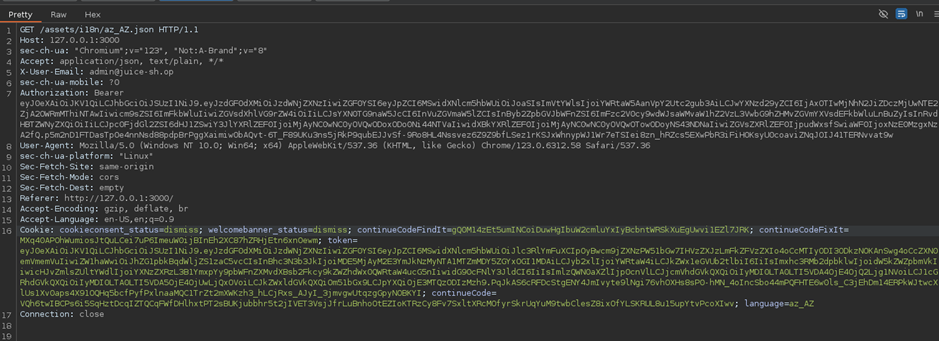
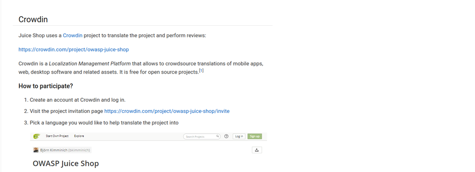
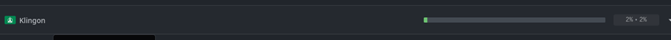

# Juice-Shop Write-up: Extra Languages

## Challenge Overview

**Title:** Extra Languages  
**Category:** Localization  
**Difficulty:** ⭐⭐⭐⭐⭐ (5/6)

This challenge involves exploiting the language selection feature to access a hidden or unsupported language setting in the Juice Shop application.

## Tools Used

- **Web Browser:** Used to interact with the language selection feature and send HTTP requests.
- **Burp Suite:** To intercept network requests and analyze responses.

## Methodology and Solution

### Step 1: Analyzing the Language Change Request

- Upon changing the language through the user interface, a network request is captured indicating that the application retrieves language files based on two components:

1. **Language Code (ISO 639-1):** A two-letter code representing the language (e.g., `fr` for French, `en` for English).
2. **Country Code (ISO 3166-1 alpha-2):** A two-letter code representing the country (e.g., `FR` for France, `US` for the United States).

- The URL format observed was:
```
/assets/i18n/{language_code}_{COUNTRY_CODE}.json
```

- Here is the network request : 



### Step 2: Exploring Available Languages

- I used the official page of the project to search section related to langages development, as suggested in the hint. I find this particular section into the companion guide : 



- We can see that everyone is able to contribute via a Crowdin project.

### Step 3: Hypothesis and Research

With a hypothesis that there might be easter eggs or hidden languages, research was directed towards unusual or fictitious languages that could be included by developers for fun or testing. To avoid to have to check every langages, I filtered Crowdin page by langs that are at the most earlier stage of development.

### Step 4: Discovery in Documentation

I made the discovery of "Klingon," a fictional language from the "Star Trek" universe, coded as `tlh_AA`.



### Step 5: Successful Injection of the Language Code

Using the discovered language code:
```
tlh_AA
```
The application responded positively by loading a new language file, which was not listed or supported officially within the user interface. This confirmed the successful exploitation of the language handling feature to access a hidden setting.

## Solution Explanation

The key to solving this challenge was understanding how the application constructs the path for language files and then leveraging documentation and additional resources to hypothesize about possible hidden features. By correctly guessing and injecting the fictitious language code, the hidden language was successfully activated.


