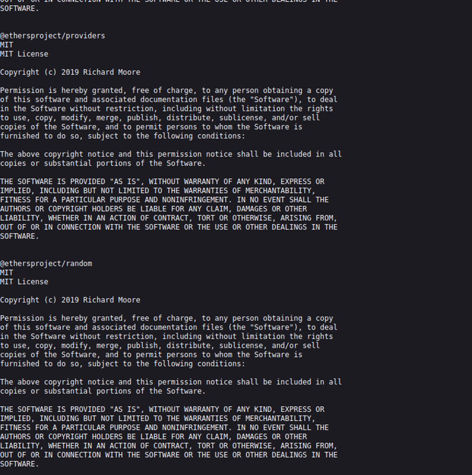

# Juice-Shop Write-up: Frontend Typosquatting

## Challenge Overview

**Title:** Frontend Typosquatting  
**Category:** Insecure Deserialization  
**Difficulty:** ⭐⭐⭐⭐⭐ (5/6)

This challenge involves identifying a typographical error in the naming of a frontend library used by the Juice Shop, which could potentially be exploited by a malicious actor.

## Tools Used

- **Web Browser:** Used to access the application's frontend and view third-party library licensing information.
- **npm Repository:** Checked the legitimacy of the libraries listed in the Juice Shop's frontend.

## Methodology and Solution

### Step 1: Accessing License Information

Navigated to `http://localhost:3000/3rdpartylicenses.txt` on the Juice Shop application to review the licensing and dependency information of third-party libraries included in the frontend built with Angular.

### Step 2: Identifying Suspicious Library

Reviewed each library mentioned in the `3rdpartylicenses.txt`:

1. **Library Review:** Each library name and version listed in the license file was verified against the npm repository to confirm their authenticity and check for any known vulnerabilities or mismatches.

2. **Spotting the Typo:** Noticed an unusual spelling for what should have been "angular2-qrcode" but was listed as "anuglar2-qrcode." This prompted a further investigation.

### Step 3: Verifying on npm

Searched for "anuglar2-qrcode" on npm to verify if it was a legitimate package:

- **npm Search:** The search confirmed that the library "anuglar2-qrcode" was indeed a typo and potentially a typosquatted package, intended to deceive users by mimicking the name of a well-known package.

### Step 4: Reporting the Issue

Reported the typo and the potential security risk associated with the typosquatted package to the Juice Shop team via the contact page within the application.

## Solution Explanation

The typographical error in the library name was a crucial discovery that led to identifying a potential security threat. By carefully reviewing and cross-referencing the third-party libraries with npm, the malicious or mistaken inclusion of a typosquatted package was successfully identified and reported.

## Security Implications and Recommendations

- **Thorough Validation:** Ensure that all third-party dependencies are thoroughly validated against reputable sources before inclusion in the project.
- **Automated Scanning:** Implement automated tools to scan and flag any discrepancies in library names, versions, and checksums.
